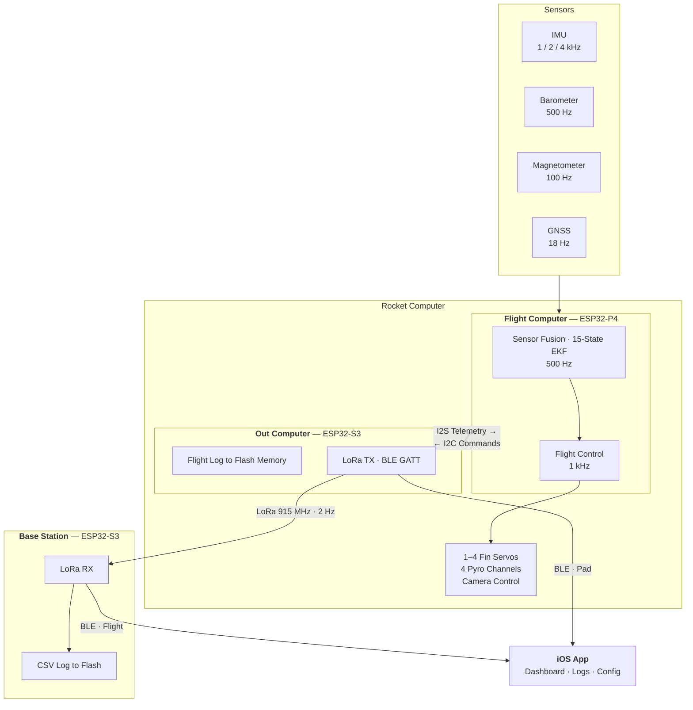

# TinkerRocket

An open source hardware and software full featured flight computer with out of the box functionality and room to tinker. The flight computer, base station, and companion iOS or Android app provide out of the box dual deploy and GNSS tracking with plenty of extra bells and whistles to support all your rocketry needs.

| | |
|---|---|
| **High-Rate Logging** | Full sensor suite data logging at configurable rates up to 4 kHz. |
| **Remote Power Switch** | Use the built-in wireless switch to disable pyro channels and install the computer days ahead of a flight. Power it up on the pad using the phone app over BlueTooth. |
| **Four Pyro Channels** | Fully isolated (low and high switched), with continuity monitoring and app configurable triggers. |
| **Camera Control** | Control a RunCam Split 4 or 'naked' GoPro, start or stop recording from the flight line before take off. Monitor current usage in the app to ensure everything is recording before you launch. |
| **Active Control** | One to four servos for roll control or flight stabilization. |
| **Modular Radio** | Swappable daughter board for the LoRa radio, shipping with a 22 dBm 900 MHz radio supporting flights up to 30,000 ft. Swap it out for an even higher power radio that communicates over UART. |
| **Modular GNSS** | Swappable GNSS daughter board. Start with the u-blox SAM-M10Q module with 18 Hz updates and multiple constellation support. Swap for another GNSS module to meet specific flight requirements. |
| **Voice Callouts** | Altitude, apogee, max speed and descent rate spoken aloud during the flight. |

<!-- TODO: add a hero photo, then restore this:
 -->

## Overview

The system comprises three physical cooperating components:

| Component | Hardware | Role |
|-----------|----------|------|
| **Rocket Computer**<br/>([Flight Computer](docs/architecture/flight-computer.md) & [Out Computer](docs/architecture/out-computer.md)) | ESP32-P4 & ESP32-S3 | Power switch, flight control, sensor fusion, data logging, LoRa transmitter, BLE ground link |
| **[Base Station](docs/architecture/base-station.md)** | ESP32-S3 | LoRa receiver, BLE ground link, LoRa data logging |
| **[iOS App](docs/architecture/ios-app.md)** | iPhone/iPad · [App Store](https://apps.apple.com/app/id6782041169) | Real-time flight data dashboard, flight and LoRa data storage, rocket and downlink configuration |

The onboard computer has both the ESP32-P4 main processor with two cores running at 400 MHz for sensor intake, flight processing, and controls. An ESP32-S3 serves as the BlueTooth Low Energy (BLE) radio as well as high speed data logger and LoRa radio control. To support guidance and control functions, the onboard flight computer runs a 15-state Extended Kalman Filter fusing IMU, barometer, magnetometer, and GNSS data at 500 Hz. Optional roll control or a proportional navigation guidance law commands 1-4 fin-tab servos through cascaded PID controllers with velocity-based gain scheduling. There are four fully programmable pyro channels. There is also an interface to power and control an on board camera, with RunCam Split4 and GoPro support currently implemented.

On plugging in a battery only the ESP32-S3 powers up; drawing only 1 milli-amp. The computer can stay in this configuration for days on a typical battery allowing you to close up the rocket without the need for a physical switch at the pad for many uses. Pyro charges are controlled by the ESP32-P4, which remains un-powered on boot of the ESP32-S3, providing a level of saftey beyond what a single processor switch can provide. Physical switches and/or shunts for air starts and pyro charges are still possible and prudent in many scenarios, so follow all safety regulations and best practices. Power up the main processor using the app before leaving the pad over the BlueTooth connection and control powering up the camera remotely from the base station over LoRa to maximize battery life and reduce camera run time. Control data recording remotely from the base station over LoRa as well, or allow flight data recording to start at launch and end at landing automatically.

The base station fits easily in your hand or pocket and can run for hours on a single rechargable battery. The base station also provides a convient charger for your flight data back, while charging the base station from a USB source you can also power your flight battery. The base stationn relays data sent over LoRa from the flight computer to a nearby iOS device, giving the user a realtime view of telemetry data prior to launch, as well as telemetry and tracking data post launch. Use your phone's speakers to call out altitude, apogee, max speed, and descent rate during the flight and to locate the rocket via an arrow that points towards the rocket and/or a map view of where the rocket landed.

Finally, manage the flight data intuitively by uploading from the flight computer to an iOS device and then sharing that data using email, text, air drop, or any other iOS supported sharing means.

## Data Analysis

**[Analyze a flight in your browser →](https://tinkerbug-robotics.github.io/TinkerRocket/)**

Drop a flight log in and get a report back: the trajectory in 3D on satellite
imagery, then altitude, velocity and acceleration, roll control, how apogee was
detected and by which sensor, stability, deployment and descent rates, the radio
link, and a panel that will plot any of the ~84 logged channels against time or
against each other.

The log never leaves your machine. The page runs this repository's own
`flight_report` Python package in the browser through
[Pyodide](https://pyodide.org) — the same code the CLI runs, so a report
generated on the site and one generated locally are the same report. There is a
sample flight on the page if you want to see the output before you fly.

For the command line, and for what each section is measuring:
**[Data_Analysis/](Data_Analysis/)** and
**[Data_Analysis/webtool/](Data_Analysis/webtool/README.md)**.

```bash
python3 -m Data_Analysis.flight_report run path/to/flight_20260705_174532.bin
```

## Architecture



## Documentation

This README covers what the system is and how to build it. For how each part actually
works — task model, data paths, state machines, and the decisions that aren't visible
from reading the code — see **[docs/architecture/](docs/architecture/README.md)**:

| Page | Covers |
|------|--------|
| [Flight Computer](docs/architecture/flight-computer.md) | ESP32-P4 — two-core task model, the 1 kHz loop, flight states, estimation gates, roll vs guidance, pyro |
| [Out Computer](docs/architecture/out-computer.md) | ESP32-S3 — the two power states, telemetry ingest, flight log, radios, BLE dispatch |
| [Base Station](docs/architecture/base-station.md) | ESP32-S3 — link recovery, the multi-rocket tracker, host-tested policy headers |
| [iOS App](docs/architecture/ios-app.md) | SwiftUI — fleet/roster model, transport, profile sync, offline maps |
| [Protocols](docs/architecture/protocols.md) | the four links, why each is shaped that way, and how to add to the wire safely |

Each page ends with a **Gotchas** section carrying the details that have cost bench time.

Two references are generated from source and re-checked in CI, so they cannot drift:

- **[Protocol reference](docs/architecture/generated/protocol-reference.md)** — message
  types, struct sizes, both BLE command spaces, flags, LoRa constants
- **[Section maps](docs/architecture/generated/)** — a navigable index of each firmware's
  `main.cpp` (they are 5,000–7,500 lines each), plus a module map for the iOS app

## Hardware

### Sensors

| Sensor | Type | Interface | Rate | Range |
|--------|------|-----------|------|-------|
| **ISM6HG256** | 6-axis IMU | SPI @ 10 MHz | 960 / **1920** / 3840 Hz | Low-g: +/-16g, High-g: +/-256g, Gyro: +/-4000 dps |
| **BMP585** | Barometer | SPI | 500 Hz | 300-1250 hPa |
| **IIS2MDCTR** | Magnetometer | I2C | 100 Hz | +/-50 Gauss |
| **u-blox M10** | GNSS | UART 115200 | 18 Hz | GPS/GLONASS/Galileo/BeiDou |
| **INA230** | Power monitor | I2C | 10 Hz | Voltage, current, SOC |

**IMU logging rate is settable from the app** — nominally 1 kHz, 2 kHz, or 4 kHz, which
land on the sensor's own output rates of 960, 1920 (default), and 3840 Hz.

### Radios

| Radio | Protocol | Frequency | Data Rate | Purpose |
|-------|----------|-----------|-----------|---------|
| **LLCC68** | LoRa | 915 MHz | 2 Hz | Rocket-to-ground telemetry |
| **NimBLE** | BLE 5.0 | 2.4 GHz | ~10 Hz | Ground-to-app telemetry |

### Control

- **12 GPIO pins** from the ESP32-P4 flight computer exposed. Library included for roll
  control using 1-4 servos (e.g. fin tabs). Configuration support for active flight
  stabilization using a proportional navigation law and multiple guide points — guide
  overhead, guide to a reverse drift-cast point, or guide to an offset
- **4x pyro channels** with continuity monitoring and configurable triggers
- **RunCam Split 4 and GoPro Hero 10 Black** support via UART/GPIO control

> **Export control.** The proportional-navigation library is subject to US ITAR
> regulations and is available to US persons. Everything else — including roll control —
> is unrestricted, and you can supply your own guidance library based on public-domain
> guidance concepts in its place. [Guidance (optional)](#guidance-optional) covers what that means for building.

One of the twelve GPIO channels is ADC-capable. None of them are servo-dedicated — they
can drive servos, carry communication, or read external sensors — so the four used for fin
tabs are a choice rather than a fixed allocation.

#### Expansion connector

All twelve channels come out on one 16-pin Molex 878321620. Odd pins are on one row, even
pins on the other, with pin 1 at the keyed end:

| | | | | | | | | |
|---|---|---|---|---|---|---|---|---|
| **odd** | `1`<br/>RTN | `3`<br/>**EXP_01** | `5`<br/>**EXP_03** | `7`<br/>EXP_05 | `9`<br/>EXP_12 | `11`<br/>EXP_10 | `13`<br/>EXP_08 | `15`<br/>VBATT |
| **even** | `2`<br/>RTN | `4`<br/>**EXP_02** | `6`<br/>**EXP_04** | `8`<br/>EXP_06 | `10`<br/>EXP_11 | `12`<br/>EXP_09 | `14`<br/>EXP_07 | `16`<br/>VBATT |

**Servos 1-4 default to pins 3, 4, 5 and 6** — nets `EXP_01`–`EXP_04`. With the return on
pins 1-2 and VBATT on 15-16, a three-wire servo lead reaches signal, power and ground
without leaving the connector.

Two things that will catch you out:

- **The numbering reverses at pin 9.** Pins 3-8 run `EXP_01`→`EXP_06` ascending; pins 9-14
  run `EXP_12`→`EXP_07` descending. Pin 9 is `EXP_12`, not `EXP_07`.
- **Pins 1-2 are a switched return, not a ground.** They go through a MOSFET whose source
  is on GND, so the firmware can cut the servo return — that is what the on-pad relax
  behaviour uses. Do not use these as a chassis ground.

Each net maps to a fixed ESP32-P4 GPIO:

| Net | GPIO | | Net | GPIO | | Net | GPIO |
|---|---|---|---|---|---|---|---|
| `EXP_01` | 45 | | `EXP_05` | 39 | | `EXP_09` | 38 |
| `EXP_02` | 44 | | `EXP_06` | 40 | | `EXP_10` | 37 |
| `EXP_03` | 43 | | `EXP_07` | 29 | | `EXP_11` | 34 |
| `EXP_04` | 54 | | `EXP_08` | 28 | | `EXP_12` | 33 |

#### Which mapping is set where

| Mapping | Set in | Changeable from the app |
|---|---|---|
| servo → GPIO pin | flight-computer board header, compile time | **No** |
| servo → fin azimuth and reversal | `FinConfigData`, BLE command 66 | Yes |
| PWM rate, pulse limits, per-servo bias, fin travel | `ServoConfigData` | Yes |

So which connector pin drives which servo is fixed when the firmware is built; where that
servo points, and how far it moves, are set live from the app.

## Flight Data

Data starts as **binary** on the rocket and stays that way until something needs to read
it. This allows high throughput data logging and efficient use of storage space. The flight 
computer packs each sensor reading into a framed record and streams it to the out 
computer, which buffers it before writing it to NAND flash. Framing is the same
everywhere — a start-of-frame marker, a type byte, a length, the payload, and a CRC — so a
truncated or corrupted record is detected rather than silently believed.

### Getting it off the rocket

| Step | What happens |
|------|--------------|
| **Download to Phone** | The app pulls the `.bin` over BLE, in chunks, straight from the rocket's flash |
| **Convert** | It is expanded to CSV on the phone — one row per IMU update, slower sensors forward-filled so every row is complete |
| **View** | Charts, 3D trajectory, and flight events, rendered from the CSV in the app |
| **Share** | The CSV goes out by email, AirDrop, or anything else iOS can share to |

The base station writes its own CSV as it receives LoRa telemetry. That one is a separate,
lower-rate record — useful for receiver specific data and a quick look analysis before your
rocket is recovered. Binary is not necessary here since data is at 2 Hz.

### Flight reports

[`Data_Analysis/flight_report/`](Data_Analysis/flight_report/) turns a `.bin` into a
self-contained **HTML report**. It reads the binary directly and runs 21 analysis
modules over it — launch detection, kinematics, apogee and pyro timing, sensor noise,
timestamp gaps, GNSS staleness, LoRa link quality, roll PID, guidance — then renders the
plots and findings into one page.

Four real flights are committed in [`examples/flights/`](examples/flights/) so this runs
out of the box:

```bash
python -m Data_Analysis.flight_report run examples/flights/flight_20260705_174532.bin
python -m Data_Analysis.flight_report run examples/flights      # all four
```

Point it at a directory and it processes every flight it finds. A report lands next to its
`.bin` unless `--out` says otherwise, and a matching `.csv` or `.json` sidecar is picked up
automatically when present.

Both subcommands take a path. Omit it and they scan a default local flight archive
(`~/Documents/Hobbies/ModelRockets/TestFlights`), which finds nothing on a fresh clone — so
pass the path explicitly.

The suite is covered by `flight-report-tests.yml` in CI, so a change to the analysis code
has to still produce a report from a real flight log.

## Repository Structure

```
TinkerRocket/
├── tinkerrocket-idf/           # ESP-IDF firmware
│   ├── projects/
│   │   ├── flight_computer/    # Flight computer firmware
│   │   ├── out_computer/       # Out computer firmware
│   │   └── base_station/       # Base station firmware
│   └── components/             # First-party + vendored ESP-IDF components
│       ├── TR_GpsInsEKF/       # 15-state GPS/INS Extended Kalman Filter
│       ├── TR_PID/             # PID controller (derivative-on-measurement)
│       ├── TR_ControlMixer/    # 4-fin cruciform mixing + gain scheduling
│       ├── TR_GuidancePN/      # Proportional navigation (git submodule)
│       ├── TR_Coordinates/     # ECEF/LLA/ENU coordinate transforms
│       ├── TR_KinematicChecks/ # Launch/apogee/landing event detection
│       ├── TR_Sensor_Data_Converter/ # Raw sensor -> SI unit conversion
│       ├── TR_RocketComputerTypes/ # Shared packed data structures
│       ├── TR_Compat/          # Arduino-API shims backed by ESP-IDF
│       ├── CRC/                # CRC16 for frame integrity
│       └── ...                 # Sensor drivers, I2S, BLE, LoRa, etc.
│
├── tests_cpp/                  # GoogleTest host-side unit tests
│   └── host_shim/              # Arduino.h/compat.h shim for non-IDF builds
│
├── TinkerRocketApp/            # iOS companion app (SwiftUI)
│
├── tinkerrocket-sim/           # 6-DOF flight simulation (Python + C++)
│   ├── src/tinkerrocket_sim/   # Physics, sensors, control, visualization
│   ├── cpp/                    # pybind11 bindings for EKF, PID, mixer, guidance
│   └── tests/                  # Pytest regression suite
│
├── examples/flights/           # Four real flight logs, for the report tooling
├── tests/integration/          # Binary log replay integration tests
├── preflight/                  # Pre-flight go/no-go checklist
│
├── docs/
│   ├── architecture/           # Per-codebase architecture pages (+ generated maps)
│   └── plans/                  # Design plans written before the work
│
├── Data_Analysis/              # Flight-log analysis and plotting scripts
├── tools/                      # Wire-code guards, doc generators, bench utilities
│
└── .github/workflows/          # CI (see below)
```

## Building

### Prerequisites

- [ESP-IDF v6.0](https://docs.espressif.com/projects/esp-idf/en/latest/esp32s3/get-started/) for firmware — every project needs v6; CI builds on `espressif/idf:v6.0.1`
- Xcode 16+ for iOS app
- Python 3.10+ for simulation
- CMake 3.16+ for host-side tests

### Guidance (optional)

The proportional-navigation guidance law lives in a separate private submodule at [`tinkerrocket-idf/components/TR_GuidancePN`](https://github.com/Tinkerbug-Robotics/TR_GuidancePN). **It is separate because it is subject to US ITAR regulations and is available to US persons** — that restriction is the reason for the split, not a preference about openness.

Everything else — roll control, EKF, sensor collection, telemetry, logging, LoRa, BLE, iOS integration, ground-test modes — builds and runs **without** it, and none of it is export-restricted. Public contributors can clone, build, flash, and contribute to any non-guidance feature with a standard, non-recursive clone. If you need guidance and cannot access this module, supply your own based on public-domain guidance concepts: [`TR_GuidancePN_Stub`](tinkerrocket-idf/components/TR_GuidancePN_Stub/TR_GuidancePN.h) is the interface to implement — the firmware already builds and flies against it.

When the submodule is not initialized:
- Firmware compiles against a header-only no-op stub (`TR_GuidancePN_Stub`). At boot the flight computer logs `PN Guidance: NOT COMPILED IN (stub active)`. All `guidance.*` call sites still exist, but each method returns zero / false.
- `tests_cpp`: the `test_guidance_pn` target is skipped at CMake configure time.
- `tinkerrocket-sim`: the `_guidance` pybind11 extension is skipped at `pip install -e` time; `tests/test_guidance_pn.py` is skipped via `pytest.importorskip`.

Contributors with access can opt in:
```bash
git submodule update --init tinkerrocket-idf/components/TR_GuidancePN
```

### Firmware (ESP-IDF)

```bash
# Flight Computer
cd tinkerrocket-idf/projects/flight_computer
idf.py build
idf.py flash

# Out Computer
cd tinkerrocket-idf/projects/out_computer
idf.py build
idf.py flash

# Base Station
cd tinkerrocket-idf/projects/base_station
idf.py build
idf.py flash
```

### iOS App

Most people want the [App Store build](https://apps.apple.com/app/id6782041169) rather than a local one. To work on the app,
open `TinkerRocketApp/TinkerRocketApp.xcodeproj` in Xcode and build for your device.

### Simulation

```bash
cd tinkerrocket-sim
pip install -e ".[dev]"
python -m tinkerrocket_sim.simulation.closed_loop_sim
```

### Cloning with Submodules

The guidance library is a private submodule. Clone with:

```bash
git clone --recurse-submodules https://github.com/Tinkerbug-Robotics/TinkerRocket.git
```

## Testing

### C++ Unit Tests (GoogleTest)

Roughly 660 tests across 35 suites, covering the safety-critical flight libraries and
the pure-logic policies extracted from firmware so they can run without hardware:

```bash
cmake -S tests_cpp -B tests_cpp/build -DCMAKE_BUILD_TYPE=Debug
cmake --build tests_cpp/build -j$(nproc)
ctest --test-dir tests_cpp/build --output-on-failure
```

| Area | Suites |
|------|--------|
| Estimation and control | `test_ekf`, `test_pid`, `test_control_mixer`, `test_guidance_pn`, `test_coordinates`, `test_orientation`, `test_geomag` |
| Flight events | `test_kinematic_checks`, `test_burnout_detector`, `test_baro_gate_policy` |
| Wire contract | `test_rocket_computer_types`, `test_lora_roundtrip`, `test_crc16_compat`, `test_uart_link_codec`, `test_ble_chunk_size` |
| Storage and logging | `test_tr_flightlog_core`, `test_tr_flightlog_wire_format`, `test_nand_bitmap_store`, `test_mram_dirty_policy`, `test_bad_block_scan_policy` |
| Base-station policies | `test_bs_*` — battery SoC, uplink queue/window/policy, log policy, download policy |
| Sensors and sim | `test_sensor_data_converter`, `test_sim_sensor_model`, `test_sim_pad_align`, `test_mag_calibrator` |

Suite-level counts are deliberately not listed here — they change with every PR. `ctest`
is the authority.

### Simulation Tests (pytest)

Around 125 tests validating that the pybind11 bindings match the flight code:

```bash
cd tinkerrocket-sim
python -m pytest tests/ -v
```

### Integration Tests

Replay binary flight logs to validate sensor rates, CRC integrity, and timestamps:

```bash
python -m pytest tests/integration/ -v
```

Place `.bin` bench test files in `tests/test_data/` -- tests auto-skip when no data is present.

### Pre-Flight Checklist

```bash
python preflight/run_preflight.py tests/test_data/bench_static_60s.bin
```

Validates sensor rates, frame integrity, timestamp health, and data completeness with a clear GO/NO-GO result.

### CI/CD

Ten GitHub Actions workflows run automatically, each path-filtered to what it covers:

| Workflow | What it does |
|----------|--------------|
| **cpp-tests.yml** | GoogleTest suites — on changes to `tinkerrocket-idf/components/`, `tests_cpp/`, or `tests/integration/` |
| **firmware-build.yml** | Full ESP-IDF build of `flight_computer`, `out_computer`, `base_station`, and `radio_board` (Docker: `espressif/idf:v6.0.1`) |
| **sim-tests.yml** | pytest for `tinkerrocket-sim/` and the component sources it binds to |
| **ios-tests.yml** | XCTest for `TinkerRocketApp/` |
| **android-tests.yml** | Pure-JVM JUnit for `TinkerRocketAndroid/` (protocol/session/maps modules) against the same golden-vector corpus the C++ and iOS suites consume |
| **android-release.yml** | Signed release APK on `android-v*` tag push — JVM suite, then `assembleRelease` signed from repo secrets, with an `apksigner` gate that fails if the APK came out debug-signed (see `docs/android-release-signing.md`) |
| **flight-report-tests.yml** | Flight-report tooling — the Python suite, plus a Node job for the Explore panel, whose choice of what to draw is made in JavaScript and so is tested there |
| **pages.yml** | Publishes the browser-based analysis tool to GitHub Pages on pushes to `main`. Builds `Data_Analysis/webtool/payload/` rather than shipping it — it is gitignored, and a committed copy would drift from the source the browser actually runs |
| **wire-codes.yml** | Fails on duplicate BLE command numbers — the dispatch is a first-match chain, so a duplicate silently makes the later handler dead code |
| **hardware.yml** | Every symbol the schematic marks `on_board` must have a footprint in the layout — on changes to `hardware/`. Nothing validated boards before this: `docs/board-versioning.md` names `kicad-cli pcb drc --schematic-parity` as the only gate, and that reconciles footprints already on the board rather than noticing one absent entirely. #833 got as far as a fab-ready V10 whose flight-battery positive terminal reached nothing but a floating pour |
| **docs.yml** | Fails if a generated section map or the protocol reference disagrees with its source, or if the prose contradicts it — broken links, a stale ESP-IDF version, a missing workflow, a wrong struct size. The only workflow with **no path filter**: it runs on every push and PR, because docs drift as a side effect of changes anywhere |

## Communication Protocols

### Binary Frame Format

All inter-board and logged data uses a consistent framing protocol:

```
[0xAA 0x55 0xAA 0x55] [Type] [Length] [Payload] [CRC16_MSB] [CRC16_LSB]
   (start of frame)     (1)     (1)   (0-MAX)      (1)         (1)
```

CRC-16 polynomial: 0x8001, initial: 0x0000.

### Message Types

The main sensor frames, with the rate each is produced at:

| Type | Name | Size | Rate |
|------|------|------|------|
| 0xA1 | GNSS | 42 B | 18 Hz |
| 0xA2 | ISM6HG256 (IMU) | 22 B | 1920 Hz (default) |
| 0xA3 | BMP585 (Baro) | 12 B | 500 Hz |
| 0xA5 | NonSensor (EKF) | 50 B | 500 Hz |
| 0xA6 | Power | 14 B | 100 Hz |
| 0xD1 | IIS2MDC (Mag) | 10 B | 100 Hz |
| 0xF1 | LoRa Telemetry | 65 B | 2 Hz |
| 0xF9 | LoRa Uplink RX | 13 B | per uplink decode |

`0xA4` (MMC5983MA, 16 B) is the magnetometer frame from an earlier sensor, still on the
wire so older logs decode.

**All 89 message types, both BLE command spaces, and every struct's wire size are in the
[generated protocol reference](docs/architecture/generated/protocol-reference.md)** —
extracted from source and CI-checked, so it cannot go stale the way a hand-kept table
does.

### I2S Telemetry Pipeline

The flight computer streams sensor data to the out computer via I2S DMA at 22,050 Hz sample rate (88 KB/s bandwidth). Frames are zero-copy from ISR callbacks into an MRAM ring buffer, then flushed to NAND flash.

## iOS App

<!-- TODO: add an app screenshot, then restore this:
 -->

**[Download TinkerRocket App on the App Store](https://apps.apple.com/app/id6782041169)** — free, iOS 16 or later, iPhone
and iPad. You do not need to build it to fly; the sources here are for contributing, or
for running a version ahead of the store release.

The app is a SwiftUI companion providing:

- Real-time telemetry dashboard (attitude, altitude, velocity, GPS, battery)
- 3D flight trajectory visualization
- Binary flight log download and CSV export
- Servo and pyro channel testing
- Flight configuration upload (PID gains, roll profiles, guidance params)
- Ballistic drift prediction (DriftCast)
- Audio/haptic flight event announcements

Connects via BLE directly to the Out Computer (on-pad) or through the Base Station (in-flight via LoRa relay).

## Multi-Device Support

The system supports connecting to multiple flight computers and base stations simultaneously, with collision avoidance for multiple users operating at the same field.

### Device Identity

Every unit has a persistent identity stored in NVS flash:

| Field | Size | Purpose |
|-------|------|---------|
| `unit_id` | 4 bytes | Hardware fingerprint (last 4 bytes of efuse MAC), immutable |
| `unit_name` | 1-20 chars | User-settable nickname (e.g. "Atlas", "PadAlpha") |
| `network_id` | 1 byte | LoRa network namespace (0-255), isolates different users |
| `rocket_id` | 1 byte | Unique ID per rocket within a network (1-254) |

Out of the box a unit names itself from its hardware ID — `TR-R-<hex>` for rockets, `TR-B-<hex>` for base stations. Once renamed, **a device advertises its user-set name verbatim**, with no prefix; the app therefore discovers devices by service UUID and never by name. The app configures identity on first connect via BLE commands 40/41/42.

### Network Isolation

Multiple users at the same field are isolated via three layers:

1. **Network ID** -- each user picks a network name on first app launch, hashed to a 1-byte ID. Devices only process packets matching their network.
2. **LoRa syncword** -- configurable via the app's LoRa settings. Different syncwords prevent radio-level decoding of other users' packets.
3. **Rocket ID** -- within a network, each rocket has a unique ID (1-254) so the base station can track and route to individual rockets.

### LoRa Frame Format

Telemetry packets (rocket to base station) open with routing and sequencing fields:

```
[network_id:1][rocket_id:1][next_channel_idx:1][seq:2][telemetry payload:60] = 65 bytes
```

`next_channel_idx` tells the base station which channel to hop to after this packet
(`0xFF` = stay put), so the two ends stay together while frequency hopping.

Uplink commands (base station to rocket) are addressed, and carry the same hop field:

```
[0xCA][network_id:1][target_rocket_id:1][next_channel_idx:1][cmd:1][len:1][payload:0-33]
```

Target rocket ID `0xFF` is broadcast (e.g., time sync). The rocket filters incoming uplinks and ignores packets for other networks or rocket IDs. An oversized payload is rejected outright rather than truncated — a truncated command would go out malformed with a consistent-looking length and no error surfaced.

### Base Station Multi-Rocket Tracker

The base station maintains a tracker array of up to 4 rockets. Each slot stores the last-known telemetry, RSSI/SNR, GPS position, and unit name. Rockets announce their name via a LoRa beacon (`0xBE` sync byte) every 2 seconds while in READY or PRELAUNCH state. The tracker auto-evicts the oldest slot when all 4 are full.

Telemetry relayed to the iOS app via BLE includes `rid` (rocket ID) and `run` (rocket unit name) fields so the app can demultiplex multiple rockets arriving through a single base station.

### iOS App Architecture

The app uses a fleet-based architecture for multi-device management:

```
BLEFleet (owns CBCentralManager, scanning, connection routing)
  ├── devices: [BLEDevice]          -- directly connected via BLE
  │   ├── BLEDevice (rocket)        -- telemetry, config, files, commands
  │   └── BLEDevice (base station)  -- relays telemetry from remote rockets
  │       └── remoteRockets: [RemoteRocket]  -- rockets seen via LoRa relay
  └── activeDeviceID                -- which device is selected

RocketRoster (rebuilt on demand from the live objects above)
  └── [RocketSubject]               -- one logical rocket, merged across every
                                       link that reaches it (direct BLE and/or
                                       one or more relaying base stations)
```

- **BLEFleet** manages the shared `CBCentralManager`, scan/discovery, and connection routing
- **BLEDevice** holds per-peripheral state (telemetry, config, file downloads, RSSI) and implements `CBPeripheralDelegate`
- **RemoteRocket** holds telemetry forwarded by a base station
- **RocketRoster** answers the question the operator actually has — *what rockets can I reach right now* — by merging links into one `RocketSubject` per rocket. It holds references, not copies, so views observe the leaf objects for per-frame updates

Rocket identity is the pair `(networkID, rocketID)`: rocket IDs are unique only within a network, so two base-station/rocket pairs on different networks may legitimately reuse one.

When multiple devices are connected, the dashboard shows a horizontal chip bar for switching between them. Remote rockets appear as orange chips with an antenna icon.

Full detail in the [iOS App architecture page](docs/architecture/ios-app.md).

### First-Launch Onboarding

On first app launch, the user picks a network name (e.g. "My Backyard", "Skyhawks Club"). This is hashed to a `network_id` and pushed to every device on first connect. When connecting to a new device (unknown `unit_id`), a provisioning sheet lets the user name the device and assign a rocket ID.

### Command Relay

Commands can be sent to a rocket either directly over BLE or relayed through a base station using BLE command 50:

```
Command 50: [target_rocket_id:1][inner_command:1][inner_payload:0-18]
```

The base station unpacks this and queues a LoRa uplink addressed to the target rocket. This enables controlling rockets that are out of BLE range but within LoRa range of the base station.

## Simulation

The `tinkerrocket-sim` package provides a full 6-DOF closed-loop flight simulation:

- RK4 physics integration at 10 kHz
- Sensor noise models (IMU bias/noise, baro spikes, GPS dropout)
- Multi-rate scheduling matching flight hardware rates
- pybind11 bindings to the same C++ EKF, PID, mixer, and guidance code used in flight
- Interactive 3D trajectory visualization (Plotly)
- OpenRocket `.ork` file import

```bash
cd tinkerrocket-sim
python scripts/run_closed_loop.py --config config/sim_config.yaml
```

## License

Copyright (c) 2026 Tinkerbug Robotics.

**Software in this repository is licensed under the [GNU General Public License
v3.0 or later](LICENSE)** — firmware, the iOS app, the simulator, and the tooling.
You may use, study, modify and redistribute it, and anything you distribute that
builds on it must be released under the same terms with source available.

**Hardware design files under [`hardware/`](hardware/) are licensed under the
[CERN Open Hardware Licence v2 — Strongly Reciprocal](hardware/LICENSE)**
(`CERN-OHL-S-2.0`). If you make or distribute a product based on these designs, or
publish a modified version of them, you must make the complete design sources
available under the same licence.

CERN-OHL-S is to hardware roughly what the GPL is to software, which is why the two
sit together here. They are separate licences covering separate files: the software
licence does not reach the board files, and the hardware licence does not reach the
firmware.

Two exceptions to the above:

| | |
|---|---|
| **Vendored components** | Third-party code under `tinkerrocket-idf/components/` keeps its own license — RadioLib is MIT, `spi_nand_flash` is Apache-2.0. Both permit inclusion in a GPL-3.0 work; their own terms continue to govern those files. See the `LICENSE` / `license.txt` in each. |
| **`TR_GuidancePN`** | The proportional-navigation guidance law is a separate private submodule and is **not** covered by this license. Everything else builds and runs without it (see [Guidance](#guidance-optional)), so the public tree is complete and buildable on its own. |

Contributions are welcome — see [CONTRIBUTING.md](CONTRIBUTING.md) for how to get set
up and what to watch out for. Contributors are asked to agree to the [CLA](CLA.md) once.

TinkerRocket controls pyrotechnic devices. As set out in sections 15 and 16 of the
GPL, it comes with **no warranty of any kind** — you are responsible for the safe
construction, testing, and operation of anything you build from it, and for
complying with the launch regulations that apply to you.
