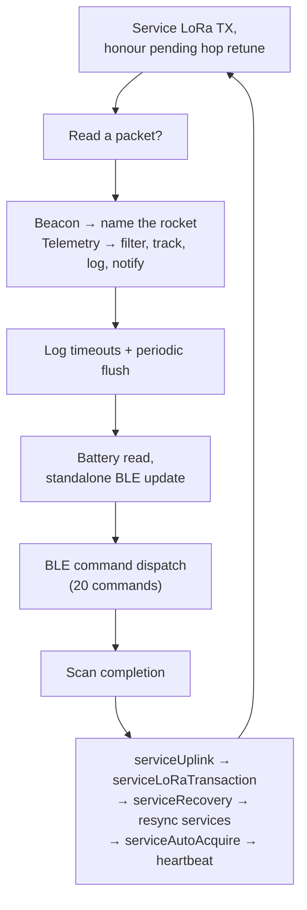

# Base Station

The Base Station is the ground half of the link. It sits on the field with an antenna,
listens for LoRa telemetry from up to four rockets at once, logs every packet to a CSV
on flash, relays what it hears to your phone over Bluetooth, and sends commands back up
to the rocket. It is the only board in the system that is not on the vehicle, and the
only one you can walk over to and pick up mid-flight.

> **New here?** Read [Overview](README.md) first for how the three boards fit together.
> The [Out Computer](out-computer.md) page covers the other end of the LoRa link.

---

## What makes this board different

The two rocket-side boards have deadlines. This one has a much harder problem: **the
other end can disappear.**

A rocket can drift off frequency, reboot with stale settings, fly out of range, sit
silent through a scrubbed launch, or come back on a different channel than it left on.
None of that is an error the Base Station can return — it just gets silence, and has to
decide what silence means and what to do about it. A large fraction of this file is that
decision-making: silence recovery, rendezvous, heartbeats, channel scans, auto-acquire,
transactional reconfiguration, and several independent resync mechanisms that each catch
a different way the two ends can drift apart.

The second difference is that a lot of that logic has been **pulled out of the firmware
entirely** so it can be tested without hardware.

## At a glance

| | |
|---|---|
| **Chip** | ESP32-S3, dual core |
| **Entry point** | [`app_main`](../../tinkerrocket-idf/projects/base_station/main/main.cpp) → `setup_bs()`, then a `bs_loop` task spinning `loop_bs()` |
| **Source** | [`projects/base_station/main/main.cpp`](../../tinkerrocket-idf/projects/base_station/main/main.cpp) (~5,200 lines) + six policy headers |
| **Navigation** | [section map](generated/base-station-map.md) — 22 sections, 6 inside `loop_bs` |
| **Execution** | one task, `bs_loop`, priority 5, 8 KB stack, core 1 |
| **Listens** | LoRa 915 MHz, up to 4 rockets tracked simultaneously |
| **Stores** | CSV per flight on external flash (FAT) |
| **Talks to your phone** | BLE GATT, 20 commands |
| **Board** | **V5 hardware** — built as `TR_BS_BOARD=3`. Earlier revisions still build (1, 2) |

## The policy headers

Six pure-logic headers sit next to `main.cpp`, each extracted so a host-side GoogleTest
can drive it without a radio, an SD card, or a BLE stack:

| Header | What it decides | Tests |
|---|---|---|
| [`bs_battery_soc.h`](../../tinkerrocket-idf/projects/base_station/main/bs_battery_soc.h) | voltage-based state of charge | 21 |
| [`bs_uplink_txwin.h`](../../tinkerrocket-idf/projects/base_station/main/bs_uplink_txwin.h) | when a transmit window is open | 19 |
| [`bs_uplink_queue.h`](../../tinkerrocket-idf/projects/base_station/main/bs_uplink_queue.h) | uplink command FIFO | 14 |
| [`bs_log_policy.h`](../../tinkerrocket-idf/projects/base_station/main/bs_log_policy.h) | when to open, roll, and close a log | 12 |
| [`bs_download_policy.h`](../../tinkerrocket-idf/projects/base_station/main/bs_download_policy.h) | BLE download chunking | 11 |
| [`bs_uplink_policy.h`](../../tinkerrocket-idf/projects/base_station/main/bs_uplink_policy.h) | whether an uplink may transmit now | 6 |

That is 83 tests over logic that would otherwise only be exercisable by standing in a
field. Anything in these headers must stay free of ESP-IDF and FreeRTOS dependencies —
`RocketComputerTypes.h` is allowed because it is pure types and host-compiles, which is
also how the rocket-side and ground-side rules are kept from drifting apart (both ends
call the same `computeFreqLockForFlight`).

**If you are adding logic to this board, this is the pattern to follow.** A predicate or
a state transition belongs in a header with a test; only the code that touches hardware
belongs in `main.cpp`.

## One loop, in order

A single task. Everything below runs on every pass, in this order, and the order matters
in several places.



The service chain at the end is sequenced deliberately: the transaction service runs
after the uplink service so it can observe the uplink queue draining, and silence
recovery runs after the transaction service so a freshly committed reconfiguration is
not immediately treated as a fault.

## Receiving

An incoming packet is one of two shapes, and telling them apart is not as simple as it
looks.

**Name beacons** are `[0xBE][network_id][rocket_id][unit_name…]` — how a rocket
announces itself so the tracker can show a name rather than a number. **Telemetry** is a
fixed-size frame whose first byte is the network id.

A telemetry frame from network id 190 would have `0xBE` as its first byte and parse as a
beacon, shadowing all telemetry from that network. The disambiguator is length: beacons
are short and telemetry is exactly `SIZE_OF_LORA_DATA`, so the beacon branch requires
`rx_len != SIZE_OF_LORA_DATA` (#384).

Packets are then filtered by network id — that is the layer that keeps two users at the
same field from seeing each other's rockets — and an SNR floor rejects noise-floor
decodes before they are counted as proof of life.

## The tracker

Up to **four rockets** are tracked at once, each slot holding last-known telemetry,
RSSI/SNR, position, and unit name. One rocket is *focused*: the app's dashboard shows it,
and the focus is sticky rather than following whichever packet arrived last.

Logging is decoupled from focus. You can watch one rocket while recording another, which
matters when several people are flying on one ground station.

## Staying in contact

This is the part worth understanding, because it is most of the file. Six independent
mechanisms, each catching a different failure:

- **Heartbeat** — every 10 s, a quiet uplink telling the rocket "we hear you". Without it
  the rocket cannot distinguish a healthy idle link from a dead one.
- **Silence recovery** — after 10 s of hearing nothing from any rocket, a two-phase hunt.
  Phase A tunes to the factory rendezvous channel and listens for 30 s. Phase B sweeps
  ±2 MHz around the NVS frequency in 21 steps of 200 kHz, dwelling one beacon cycle each.
- **Transactional reconfigure** — changing frequency is a two-sided commit. The Base
  Station does not simply retune and hope; it confirms the rocket followed, and rolls
  back to the old frequency if not.
- **Coordinated noise scan** — a multi-pass RSSI scan that produces a channel skip mask,
  which is then pushed to the rocket so both ends hop over the same bad channels.
- **Auto-acquire** — one shot per power cycle: wait to hear a rocket, then converge on it.
- **Resync services** — `serviceMaskDriftRepush`, `serviceHopModeResync`, and
  `serviceHopDisableDrain` each re-push a setting when received frames show the rocket
  did not actually adopt it.

The common design idea: **evidence, not assumption.** The Base Station does not trust
that a pushed setting was applied. It watches the frames coming back and re-pushes when
they disagree.

## Logging

Each flight becomes a timestamped CSV on external flash, mounted FAT. A log opens on
first packet and closes on one of three conditions: an explicit stop, an in-flight safety
timeout, or five minutes of silence. Writes are flushed periodically rather than per
packet, since `fflush()` only pushes stdio buffers down to the driver.

The clock comes from the phone over BLE, so filenames carry a real date instead of a
GNSS sentinel. A log opened before that sync gets renamed once the time arrives.

## Power

The current V5 board carries a **MAX17303G+** gauge and an MP2672 flight-pack charger.
(Superseded revisions used the MAX17205G or BQ27Z746; the gauge is probed at runtime, so
it does not depend on the build flag.) `maintainBatteryFets()` keeps the protection FETs enabled —
the BQ27Z746 ships with `FET_EN=0` and reverts to it on reset, so a fresh gauge presents
as a dead battery that only works on USB.

It re-enables only when there is no active safety fault, never overriding a real
protection event, and separately flags the "commanded on but not conducting" case, which
is a gate-drive or assembly fault rather than a firmware one.

---

## Gotchas

Things that have cost real bench time.

**LoRa RF settings are read from NVS at boot and then deliberately thrown away.** Every
power cycle forces the hardcoded factory rendezvous frequency, spreading factor,
bandwidth, coding rate, and TX power, so the two ends always meet on a known channel no
matter what either side has stored (#136). Commits still write through to NVS during a
session for BLE readback — but those values **do not drive boot configuration**. If you
are wondering why your saved frequency did not survive a reboot: it was not supposed to.
The one exception since #150 is `hopdis` (fixed vs. hopping), which is user-selected and
does honour NVS.

**Identity NVS migrates; LoRa NVS wipes.** The two namespaces version separately and on
purpose. Wiping identity is what caused the #133-era regression: the Base Station came
back with `nid=0` while the rocket kept `nid=180`, and the network-id filter silently
dropped every packet — a total link failure with no error anywhere.

**A beacon and a telemetry frame can look identical on the first byte.** See Receiving
above. If you add a packet type, disambiguate on something stronger than a sync byte.

**Duplicate `ble_cmd ==` values fail silently.** Same first-match dispatch as the Out
Computer, same consequence: the second handler becomes dead code with no error.
[`tools/check_ble_command_ids.py`](../../tools/check_ble_command_ids.py) guards it in CI.
Note the two command spaces are independent — cmd 50 means "mag-cal start" to the Out
Computer and "relay to rocket" here, and that overlap is correct.

**A decoded packet is not proof of life.** `last_packet_ms` is deliberately not bumped at
the point where a packet merely passes the SNR floor and has the right shape. Doing so
suppressed silence recovery and, worse, satisfied a command's "the rocket is alive"
predicate on what was really just noise (#384).

**The build flag does not match the board number on the silkscreen.** The current
hardware is **V5**, and it is built as **`TR_BS_BOARD=3`** — the two numbering schemes
diverged and have not been reconciled. Build the current board with:

```bash
idf.py -B build_v3 -DTR_BS_BOARD=3 build
```

A plain `build/` directory defaults to `TR_BS_BOARD=2`, a superseded board. Flashing that
onto a V5 gives you a **working boot with the wrong pin map** — no error, just peripherals
that are not where the firmware thinks they are.

**`sdkconfig` is generated and untracked, and it overrides `sdkconfig.defaults`.** Same
trap as the other firmwares: editing the defaults file does nothing while a stale
`sdkconfig` sits beside it, and a symbol that no longer exists fails silently. Because
builds here are per-board, each build dir carries its own — delete it and rebuild when a
config change appears to have no effect.

---

## Where to look next

- [Section map](generated/base-station-map.md) — every region of `main.cpp` with line
  ranges and links, regenerated from the source banners
- [Out Computer](out-computer.md) — the other end of the LoRa link
- [Flight Computer](flight-computer.md) — what produces the telemetry that arrives here
- [iOS App](ios-app.md) — the BLE peer this board serves
- Policy tests: [`tests_cpp/`](../../tests_cpp/) — `test_bs_*.cpp`, 83 tests
- Components: `TR_RadioLink`, `TR_LoRa_Comms`, `TR_BLE_To_APP`, `TR_MAX17205G`,
  `TR_MAX17303`, `TR_MP2672`, `TR_BQ27Z746`
- [Protocols](protocols.md) — LoRa framing and the BLE command spaces
- Shared wire contract: [`RocketComputerTypes.h`](../../tinkerrocket-idf/components/TR_RocketComputerTypes/RocketComputerTypes.h)
