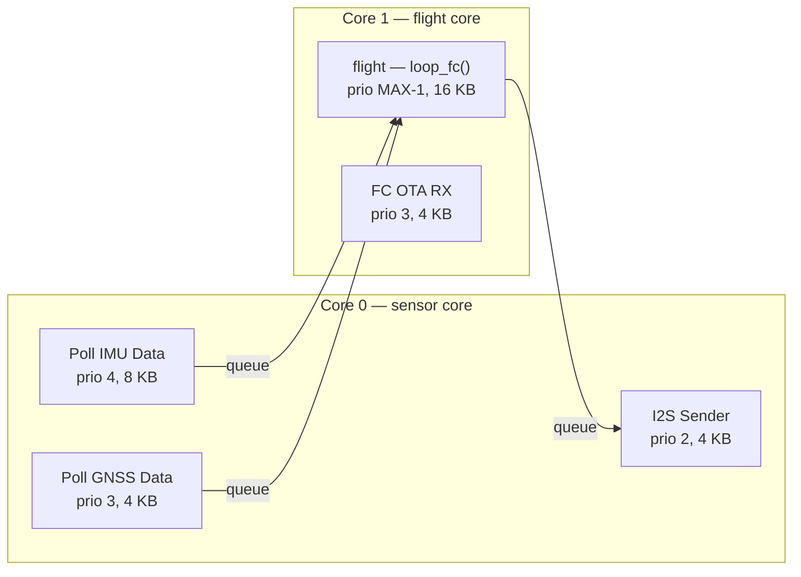
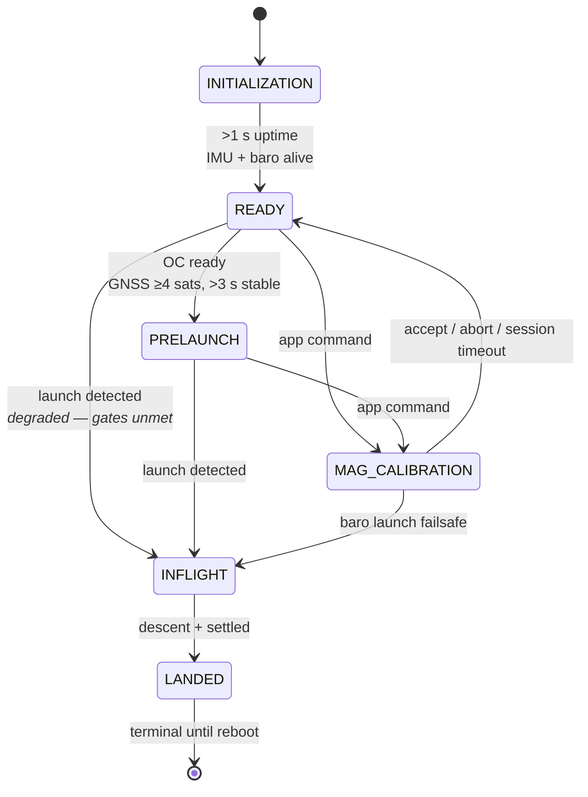

# Flight Computer

The Flight Computer (FC) is the part of the rocket that decides things. It reads the
sensors, estimates where the vehicle is and how it is pointed, runs the control law
that drives the fin servos, decides when the rocket has launched and when it has
reached apogee, and fires the pyro channels. Everything it produces — telemetry,
events, log frames — is handed to the [Out Computer](out-computer.md) to store and
transmit.

> **New here?** Read [Overview](README.md) first for how the three boards fit
> together, and the [Out Computer](out-computer.md) page for the other half of the
> rocket-side story.

---

## Why it is its own processor

The FC exists so that nothing on the flight path ever has to wait. It runs no radio,
touches no flash, and serves no file transfers — all of that lives on the Out Computer
behind a link the FC can ignore. What is left is a loop that reads sensors, updates a
filter, and writes servo commands, at a rate that must not vary.

That constraint shows up everywhere in this file. It is why the sensor drivers get
their own core, why the I2C link to the Out Computer is *polled by the FC* rather than
interrupt-driven, and why that poll is skipped entirely in flight.

## At a glance

| | |
|---|---|
| **Chip** | ESP32-P4, dual core |
| **Entry point** | [`app_main`](../../tinkerrocket-idf/projects/flight_computer/main/main.cpp) → `setup_fc()`, then a `flight` task spinning `loop_fc()` |
| **Source** | one file, [`projects/flight_computer/main/main.cpp`](../../tinkerrocket-idf/projects/flight_computer/main/main.cpp) (~7,350 lines) |
| **Navigation** | [section map](generated/flight-computer-map.md) — 28 sections, 12 of them inside `loop_fc` |
| **Flight loop** | 1000 Hz |
| **Estimator** | 15-state error-state EKF at 500 Hz (loop rate ÷ `EKF_DECIMATION`) |
| **Sensors** | IMU 960/1920/3840 Hz (app-settable, default 1920), barometer 500 Hz, magnetometer 100 Hz (V8 IIS2MDC; 200 Hz on older MMC5983MA boards), GNSS 18 Hz |
| **Outputs** | 1–4 fin servos, 4 pyro channels, camera control, piezo, status LED |
| **Talks to the OC** | I2S out (telemetry, master TX) + I2C out (command poll, master) |

## Two cores, five tasks

This is the FC's defining structure, and it is the opposite arrangement from the Out
Computer. Sensor acquisition gets its own core so that nothing the flight loop does can
starve it.

The flight task runs at `configMAX_PRIORITIES - 1` — the highest priority in the
system — and is subscribed to the task watchdog. Its 16 KB stack is not arbitrary: the
EKF's `timeUpdate()` and `measUpdate()` allocate roughly 7.5 KB of temporary 15×15
matrices on the stack per call.

The queues between the poll tasks and the flight loop are what make this work. They are
also what a past bug ate through: when a blocking I2C poll stalled `loop_fc()`, samples
piled up and were silently dropped, with nothing in the telemetry to say so. The IMU
queue is now deep enough to ride out a stall, and an overflow raises `NSF2_FC_IMU_DROP`
in the telemetry flags so the drop is visible rather than inferred (#474).

## What one loop pass does

`loop_fc()` is half the file. It runs freely at whatever rate the hardware allows, but
the flight logic inside is gated to `FLIGHT_LOOP_UPDATE_RATE` (1000 Hz).

1. **Drain the sensors.** *All* pending IMU samples are pulled each pass — the chip runs
   at 1920 Hz, about two samples per pass — and every one is forwarded to the I2S log so
   the recorded rate follows the sensor's own output rate rather than the loop rate.
   Only the freshest sample feeds the EKF and control path.
2. **Publish magnetometer calibration status**, if a calibration is running.
3. **Compute pressure altitude.** The ground reference tracks continuously through the
   pre-flight states and then *freezes* at `PRELAUNCH` — see Gotchas.
4. **Update the EKF** (every other pass, so 500 Hz).
5. **Poll the Out Computer over I2C** for a pending command — skipped in flight.
6. **Dispatch that command** — roughly 60 handlers, the largest block in the file. It
   runs only on a pass that polled: it is the tail of the poll transaction, so between
   polls, and for the whole of a real flight, it is a no-op.
7. **Run kinematic checks**: launch, apogee, and landing detection with per-sensor health
   feeding an adaptive quorum.
8. **Run the state machine**, including pyro servicing and the control law.
9. **Pack and send telemetry** (`NonSensorData` at 500 Hz).
10. **Service sound, LED, and camera** timers, then periodic diagnostics.

## Flight states

`READY → PRELAUNCH` is the gate that says the vehicle is genuinely ready to fly: the
Out Computer is answering, and GNSS has held a fix with at least four satellites for
three seconds. Entering `PRELAUNCH` freezes the barometric ground reference and runs a
pyro continuity check.

The `READY → INFLIGHT` edge is the honest one. If launch is detected without those gates
met — no GNSS lock, Out Computer not answering — the FC does not refuse to fly. It
promotes straight to `INFLIGHT` through the same entry path in a degraded mode: guidance
off, reference-position freeze skipped, ground pressure taken from whatever the pad gave
it. A rocket that has left the pad is in flight whether or not the software approves.

`MAG_CALIBRATION` is entered from `READY` or `PRELAUNCH` — `PRELAUNCH` is the automatic
outdoor ground state (4 sats + 3 s, no operator action), so refusing it would refuse mag
cal in the field essentially always. `INFLIGHT` and `LANDED` are refused. Every exit lands
in `READY`, so the pad gates are re-run from scratch afterwards.

While in the state, `kinematicChecks()` is skipped so the operator's tumble cannot latch
`launch_flag` (#216). That is a safety property while the operator is present and a hazard
if the session is never ended, because launch detection and pyro servicing are both off —
so the state has two exits that do not depend on the app (#1118): a session timeout, and a
launch failsafe that watches barometric altitude rather than `launch_flag`, since the
detector is off. A hand tumble cannot produce tens of metres of sustained climb; a lit
motor produces it in well under a second.

`LANDED` is terminal. It sets `post_flight_lockout`, which is re-asserted at the top of
the state machine on every pass, so no command and no re-triggered launch detect can
start a second flight without a reboot (#317). The simulator's Stop command is the one
deliberate re-arm, and it counts only when a sim flight was started this boot; a Stop
that reaches a real flight's `LANDED` is ignored (#1113).

`MAG_CALIBRATION` is a bench-only state entered by app command and refused in
`PRELAUNCH`/`INFLIGHT`/`LANDED`. While in it, kinematic checks are skipped, EKF init is
inhibited, and pyro servicing cannot run — the user is physically tumbling the rocket,
and every automatic path that could misread that has to be closed.

## Estimation

A 15-state error-state EKF fuses IMU, barometer, magnetometer, and GNSS. The IMU feed is
converted from the sensor library's FLU convention (X forward, Y left, Z up) to the
filter's FRD (X forward, Y right, Z down) on the way in.

Two gates are worth knowing:

- **GNSS acceptance** requires a 3D fix, a minimum satellite count, a horizontal-accuracy
  bound, and a genuinely new fix timestamp. Initialization applies tighter accuracy plus
  a low-velocity check, since the filter's init assumes a stationary pad.
- **Accelerometer attitude correction is disabled during powered flight and coast**
  (`use_ahrs_acc`), because specific force is nowhere near 1 g and gravity is not
  recoverable from it. It comes back on after apogee: blanket-disabling it through
  descent starves the filter of its gravity reference and freezes the velocity estimate.

Baro has its own hazard. Above roughly Mach 0.76 the static port reading is unusable, so
a lockout suppresses barometric apogee voting between 260 m/s (on) and 240 m/s (off).

## Control

Two mutually exclusive modes, chosen in the app.

**Roll control** nulls roll rate with a PID driving the fin tabs through the control
mixer. It starts once **two** activation gates have both opened: a configurable
`roll_delay` after launch, and a configurable `roll_min_speed` the vehicle must reach.

The speed gate exists because fin authority scales with the square of airspeed while the
delay only tracks the clock, and the time to reach a useful speed changes with motor,
mass and rail exit. A loop that engages at rail speed commands deflection the fins cannot
deliver, winds up, and then departs when authority arrives. The 54 mm roll-control flight
of 2026-08-29 flew with `roll_delay` at zero: it engaged at 7 m/s, held the fin command
at its ±20° limit for a third of the first half second, and reached 904 °/s of roll at
T+0.50 s as authority came in around 40–55 m/s. `roll_min_speed` defaults to 0, which
disables it and preserves the delay-only behaviour.

The speed gate is a **latch**: once satisfied it stays open for the flight, so control
does not drop out and re-engage as the vehicle slows through apogee. It reads the EKF
speed, so it cannot open before the filter initialises. If it never opens the fins stay
neutral for the whole flight — burnout, apogee and every pyro channel are detected
outside the servo branch, so recovery is unaffected. That is the safe failure, and the
firmware logs a warning once if the gate is still shut five seconds after launch.

**Guidance** adds a proportional-navigation law on top. It is gated on the *same* two
activation gates, which is the subtle part: guidance begins after **launch**, not after
burnout. To keep guidance out of the boost phase, set `roll_delay` to approximately the
motor burn time.

Guidance additionally requires a healthy EKF, sufficient airspeed, and a tilt within
limits. The tilt check is a **latch** — once tripped, guidance is off for the remainder
of the flight and the vehicle reverts to roll-only. Before the activation gates open, and
whenever the EKF is unhealthy, the control path falls back to a pure gyro rate-null that
needs no state estimate at all.

## Pyro

Four independent channels, each with a configurable trigger mode and value, continuity
sensing, and an arm/fire pair. They are serviced only from the `INFLIGHT` state, and
`pyroSafeAll()` runs on landing.

The initialization sequence is deliberately hand-rolled — see Gotchas. This is the one
part of the FC that can do something irreversible to a person standing nearby.

## Talking to the Out Computer

Two links, opposite directions, different roles.

**I2S carries telemetry out.** The FC is master TX, streaming packed sensor frames
continuously. A sender task on core 0 owns the write so the flight loop never blocks on
it. During an OTA the link flips: the FC becomes slave RX and receives a firmware image
through the same pins. The Out Computer's finish or abort command ends that session — or,
if neither ever arrives (a dropped command, an Out Computer reboot mid-transfer), the FC
ends it itself: no accepted image byte for 30 s once the Out Computer has released the
clock, and a new begin supersedes a session that is still open (#1116). Left open, the
flipped link means no telemetry out, the navigation filter paused and the flight loop
throttled, with no way back short of a battery pull.

**I2C carries commands in.** The FC is master and polls the Out Computer every 250 ms,
reading a combined `[status][optional config]` response of exactly 96 bytes. The protocol
is pipelined — read the previous query's response, then send the next query — so the Out
Computer gets a full poll interval to prepare each answer.

That poll is **skipped entirely during `INFLIGHT`**, with one exception: a simulated
flight keeps polling so a stop command can land mid-run. In a real flight, no app or
ground command reaches the FC at all.

---

## Gotchas

Things that have cost real bench time.

**Never use `gpio_reset_pin()` on a pyro output.** It briefly enables the internal
~50 kΩ pull-up as part of its disable configuration. The gate drivers are pre-biased
NPNs with a 2.2 kΩ base resistor and 47 kΩ base-emitter pull-down, so that pull-up biases
the base above VBE for the microseconds between reset and the subsequent
pull-up-disable — long enough to momentarily turn on the ARM and FIRE MOSFETs and twitch
the squib rail at boot. `safePyroOutputInit()` exists for exactly this: it pre-loads the
output register to 0, detaches any peripheral signal, selects plain GPIO on the IO MUX,
and only then enables drive, so the pad goes from high-Z straight to driving low.

**The barometric ground reference freezes at `PRELAUNCH`, and it has to.** If it kept
updating, the pressure ratio would stay near 1.0, computed altitude would stay near zero,
the filtered altitude rate would never cross the launch threshold, and launch detection
would deadlock. The reference tracks through `INITIALIZATION` and `READY` — typically ten
seconds or more — so it is well settled by then.

**Do not clear `out_pending_command` when you dispatch it.** The Out Computer repeats
each command across several polls for I2C reliability, and that field mirrors what the OC
is currently reporting. Clearing it at dispatch makes the reset fire between polls and
every repeat re-executes the command. The dedup key is `last_processed_cmd`, and it
resets only when the OC actually reports 0.

**A config retry means the next poll, not the next loop pass.** A config handler that
finds no config frame in the read clears the dedup key so that the OC's next delivery —
which re-stages the frame — gets another attempt. That only works because the dispatch
block runs solely on the pass that polled. `out_pending_command` is written by nothing but
the poll, so a dispatch that ran on every pass re-fired about a millisecond later against
the same stale bytes and spent ~38 ms per pass inside `readConfigFrame()` — a ~26 Hz
flight loop for the rest of the OC's repeat window, and for the rest of the flight once a
real `INFLIGHT` stopped the poll (#1112). Each served command also gets a retry budget of
three; after that the key keeps the command until the OC reports 0, so a frame the OC
dropped, or an OC that stopped answering, cannot be re-read forever.

**Attitude drifts on the pad and that is not a bug.** Sitting vertical puts the vehicle
at an Euler-angle singularity, so roll and yaw trade off against each other freely while
the quaternion stays perfectly steady. Read the quaternion, not the Euler triple, when
judging pad attitude.

**A test mode active at launch is force-cleared.** Ground test, servo test, and servo
replay all live in an `else` chain ahead of the state machine, so a test left running
would suppress `PRELAUNCH → INFLIGHT` and pyro servicing for an entire flight — no
drogue, no main, ballistic return. Launch detection now clears any active test as a
failsafe (#363). A bench false positive merely drops you back into `READY`, which is safe.

**The EKF is handed the last accepted GNSS fix, unchanged, on every tick.** The filter
fuses each fix's timestamp once and skips a repeat, so which fixes have been consumed is
tracked in one place: the filter. The loop used to keep its own consumed markers and,
once they said seen, pass an all-zero position and velocity under the marker's
timestamp. Whenever the two disagreed the filter fused a lat=0/lon=0/vel=0 fix: first on
decimation-off ticks (#367), then on ticks where a frozen IMU timestamp skips the whole
EKF update before its GNSS block (#1107). The feed lives in `EkfGnssFeed.h` in the EKF
component and the mini shares it. Never hand the filter a placeholder: a real fix, or
the previous one again.

**`sdkconfig` is generated and untracked, and it overrides `sdkconfig.defaults`.** Same
trap as the other firmwares: editing the defaults file does nothing while a stale
`sdkconfig` sits beside it, and a symbol that no longer exists fails silently. Delete
`sdkconfig` and rebuild when a config change appears to have no effect.

---

## Where to look next

- [Section map](generated/flight-computer-map.md) — every region of `main.cpp` with line
  ranges and links, regenerated from the source banners
- [Out Computer](out-computer.md) — where this board's telemetry goes
- [Base Station](base-station.md) — where it goes after that
- [iOS App](ios-app.md) — where the profile this board flies comes from
- Components: `TR_Sensor_Collector`, `TR_GpsInsEKF`, `TR_KinematicChecks`, `TR_PID`,
  `TR_ControlMixer`, `TR_GuidancePN`, `TR_ServoControl_ledc_mult`, `TR_Orientation`
- [Protocols](protocols.md) — the I2S and I2C links this board drives
- Shared wire contract: [`RocketComputerTypes.h`](../../tinkerrocket-idf/components/TR_RocketComputerTypes/RocketComputerTypes.h)
- Host tests for the flight-critical math live in [`tests_cpp/`](../../tests_cpp/)
