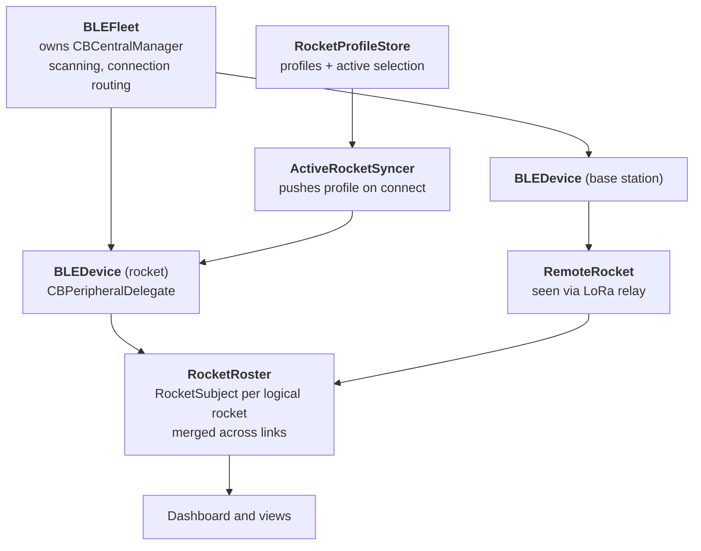

# iOS App

The app is the ground crew's interface to everything else. It connects over Bluetooth
to a rocket on the pad or to a Base Station on the field, shows live telemetry, holds
the settings each airframe flies with, downloads flight logs, calls out altitude and
apogee aloud during flight, and points you at where the rocket came down.

> **New here?** Read [Overview](README.md) first. The three firmware pages —
> [Flight Computer](flight-computer.md), [Out Computer](out-computer.md),
> [Base Station](base-station.md) — cover what is on the other end of the link.

---

## The app is the source of truth

This is the design decision everything else follows from, and it is worth stating
plainly because it is the opposite of what you might assume.

**Settings live in the app, not on the flight computer.** Each airframe gets a
`RocketProfile` — gains, servo biases, roll profile, camera, pyro, magnetometer
calibration — stored on the phone. When a rocket connects, the app pushes the *whole
active profile* to it. The rocket flies the profile's settings, never whatever happened
to be left in its NVS.

That fixes a specific, expensive failure: swapping the flight computer between airframes
and flying the previous airframe's tuning without noticing.

Two consequences fall out of it:

- **The push is not a diff.** The config readback does not echo every field — servo
  biases 2–4, roll waypoints, and sound settings are absent from it — so a reliable
  field-by-field diff is impossible. Connects happen once per flying session, so a
  handful of idempotent writes is cheaper than the bugs a partial diff would invite.
- **You get an offline queue for free.** Edits made while disconnected are saved to the
  profile and ride out on the next connect. There is no separate pending-changes
  mechanism because there does not need to be one.

## At a glance

| | |
|---|---|
| **Platform** | SwiftUI, iOS |
| **Entry point** | [`TinkerRocketAppApp.swift`](../../TinkerRocketApp/TinkerRocketApp/TinkerRocketAppApp.swift) — onboarding on first launch, then the dashboard |
| **Source** | ~25,500 lines across 65 Swift files |
| **Navigation** | [module map](generated/ios-app-map.md) — every file, what it declares, and its sections |
| **Transport** | BLE GATT: one service, four characteristics |
| **Telemetry** | JSON over notify |
| **Persistence** | one JSON file per profile in Application Support; CSV cache in Documents |
| **Tests** | 270, across 29 test files |

Unlike the firmware, this codebase is not a monolith — the files are the structure, and
they already carry Swift's `// MARK: -` markers. The module map is generated from those
and from the type declarations, so nothing in the Swift sources needed changing to
produce it.

## The object graph

**`BLEFleet`** owns the single `CBCentralManager` and routes connection events to
individual devices. **`BLEDevice`** is one connected peripheral — rocket or Base Station
— and implements `CBPeripheralDelegate`. **`RemoteRocket`** is a rocket the app has
never talked to directly, seen only through a Base Station's LoRa relay.

**`RocketRoster`** sits on top and answers the question the user actually has: *what
rockets can I reach right now?* A `RocketSubject` is one logical rocket merged across
every link that currently reaches it — a direct BLE connection, one or more relaying
Base Stations, or both at once. The roster holds references rather than copies, so views
observe the leaf objects for per-frame updates and only re-derive the roster when the
set of links changes.

**Rocket identity is the pair `(networkID, rocketID)`.** Rocket IDs are unique only
within a network, so two Base Station/rocket pairs on different networks may legitimately
use the same rocket ID. Every per-rocket cache and selection keys on the pair.

## Two ways to reach a rocket

| | Direct BLE | Via Base Station |
|---|---|---|
| Connected to | the rocket's Out Computer | a Base Station on the field |
| Range | metres — on the pad | kilometres — in flight |
| Telemetry | richer, full field set | trimmed to fit the LoRa frame and BLE MTU |
| Commands | sent straight to the device | wrapped in a relay command, forwarded over LoRa |

The app does not make you choose. A rocket reachable both ways appears once in the
roster, with the links merged behind it.

## Transport

One GATT service with four characteristics:

| Characteristic | Carries |
|---|---|
| Telemetry | JSON notifications — live state, and config readback (`"type":"config"`) |
| Command | command byte plus payload, app → device |
| File ops | listings, delete, download requests |
| File transfer | binary chunks with a 7-byte header |

Telemetry and config both arrive as JSON on the same characteristic, distinguished by a
`type` field. Field names are heavily abbreviated (`sb1`, `kp`, `rdly`) because the frame
is budgeted against the negotiated BLE MTU.

That budget matters for reading the UI correctly: when a worst-case in-flight frame does
not fit, the Base Station drops low-priority tail fields and sets `"tr":1`. The app
surfaces that as `fields_trimmed` so missing values read as *trimmed for bandwidth*
rather than *sensor offline* — see Gotchas.

## Flight logs

Downloads come over the file-transfer characteristic as offset-tagged binary chunks,
which the app reassembles, parses with `MessageParser`, converts to engineering units
with `SensorConverter`, and writes out as CSV through `CSVGenerator`. `FileCache` keeps
the results in Documents so a flight can be reopened, charted, and shared without
re-downloading it.

`CSVParser` reads them back for the chart and trajectory views, and is one of the more
heavily tested pieces in the app.

## What runs during a flight

- **`FlightAnnouncer`** speaks burnout speed, altitude, apogee, descent rate and
  distance, and landing through `AVSpeechSynthesizer` — so you can watch the sky instead
  of the screen. The dispatch logic is behind a protocol so tests can substitute a spy
  without instantiating an audio session.
- **`LandingPredictor`** classifies flight phase and runs a forward drift simulation from
  the current state. The point is the failure case: if LoRa drops mid-flight, the last
  published prediction stays pinned on the map so the recovery walk still has a target.
  The algorithm mirrors the Python validation tool in `Data_Analysis/`.
- **`DriftCastEngine`** is the reverse problem, run before the flight: given where you
  want to land, fetch a wind profile, walk upwind from the target to find the apogee
  guidance point, check the steering angle is feasible, then forward-verify.
- **Offline maps** (`Maps/Offline/`) cache map tiles for regions you select ahead of time,
  because launch sites tend not to have cell service.

## Testing

270 tests across 29 files, and they are aimed at the logic that is expensive to test any
other way: roster merging, profile migration, CSV round-trips, landing prediction, MTU
trimming, focus pinning, unit formatting, and the announcer's dispatch.

The pattern to follow when adding to this codebase: **make the logic injectable and test
it off-device.** `RocketProfileStore` takes its directory and `UserDefaults` as
parameters so it can run against a temp dir; `FlightAnnouncer` hides behind a protocol so
no audio session is needed. Neither of those seams exists for elegance — they exist so
the behaviour has tests.

---

## Gotchas

Things that have cost real bench time.

**Settings apply on change. There is no Apply button (#144).** Every rocket-config
control writes through as soon as it changes. If you add a setting, wire it the same way
— a control that waits for a confirmation step is inconsistent with every other control
on the screen, and the user will assume it took effect.

**Never read live telemetry inside a `Form` section that holds a focused `TextField`
(#361).** The section re-renders on every telemetry frame, which drops the keyboard
mid-entry and makes the field feel frozen. Keep live readback and text entry in separate
sections.

**Use `lastValidRocketFix` for the map marker, not `telemetry.latitude` (#140).** The
Base Station keeps streaming to the phone even when its LoRa link goes quiet or a packet
carries no fresh GPS. Those arrive as a `TelemetryData` with `lat`/`lon` nil, which blanks
the marker. The latched fix only advances on a usable solution, so the marker stays parked
on the last known position — which is exactly what you want when you are walking toward it.

**`"tr":1` means the frame was trimmed, not that a sensor died.** The Base Station drops
low-priority tail fields when a worst-case in-flight frame will not fit the BLE MTU
(#282). Any new telemetry field needs a considered position in the priority order, or it
becomes the field that silently disappears when it matters most.

**The scanner filters on service UUID only — never on the advertised name.** The firmware
advertises the raw user-set unit name, and only factory defaults carry the `TR-R-` /
`TR-B-` prefix. A belt-and-suspenders name guard silently dropped every device that had
ever been renamed through My Devices. The name is still used *after* discovery, to
recover a renamed device's type from the registry, but it must never gate the scan.

**Config export mirrors the full `RocketProfile`, not the flight snapshot (#297).** The
two are non-overlapping supersets on purpose: app-only recovery fields (descent rates,
main deploy altitude, ballistic drag, notes, waypoint metadata) never reach the firmware
at all. An export built from `FlightSettingsData` would silently lose them.

**`nonisolated deinit {}` is load-bearing, not clutter.** It appears in six classes with
the same comment. Under `SWIFT_DEFAULT_ACTOR_ISOLATION = MainActor`, the implicit isolated
deinit routes through a runtime back-deploy shim that aborts with "pointer being freed was
not allocated" when the object is deallocated inside a synchronous XCTest
(swiftlang/swift#87316). None of these classes have deinit-time logic, so skipping the
executor hop is free — and it un-crashes every test that creates and tears down an
instance. Deleting it looks harmless and breaks the test suite.

---

## Where to look next

- [Module map](generated/ios-app-map.md) — every file with its declared types and
  sections, regenerated from the sources
- [Out Computer](out-computer.md) — the BLE peer when connected directly to a rocket
- [Base Station](base-station.md) — the BLE peer when connected on the field
- [Flight Computer](flight-computer.md) — what ultimately consumes the pushed profile
- Tests: [`TinkerRocketAppTests/`](../../TinkerRocketApp/TinkerRocketAppTests/)
- Wire-code guard: [`tools/check_ble_command_ids.py`](../../tools/check_ble_command_ids.py)
  reports the app's command numbers for information — the firmware dispatch is the
  authority
