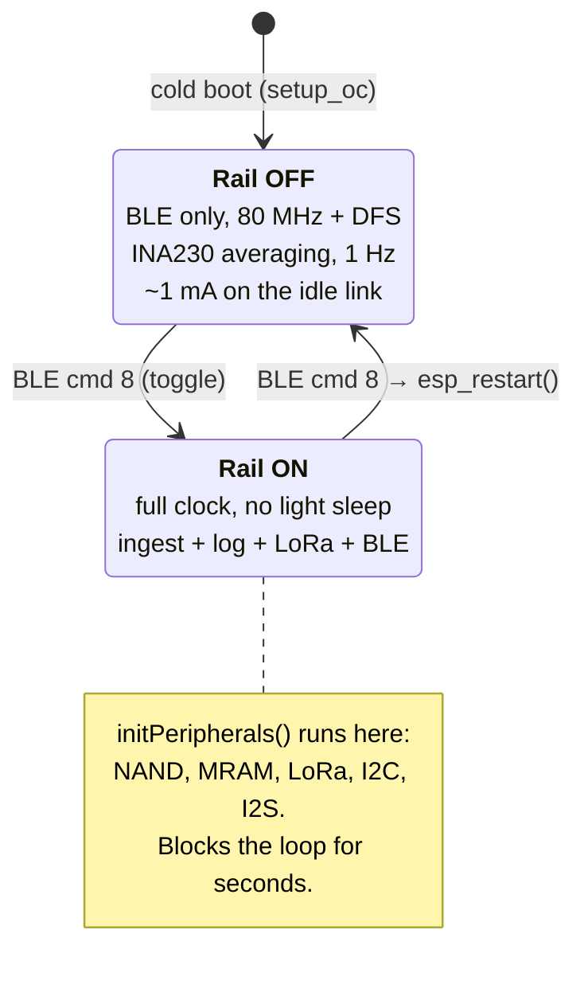
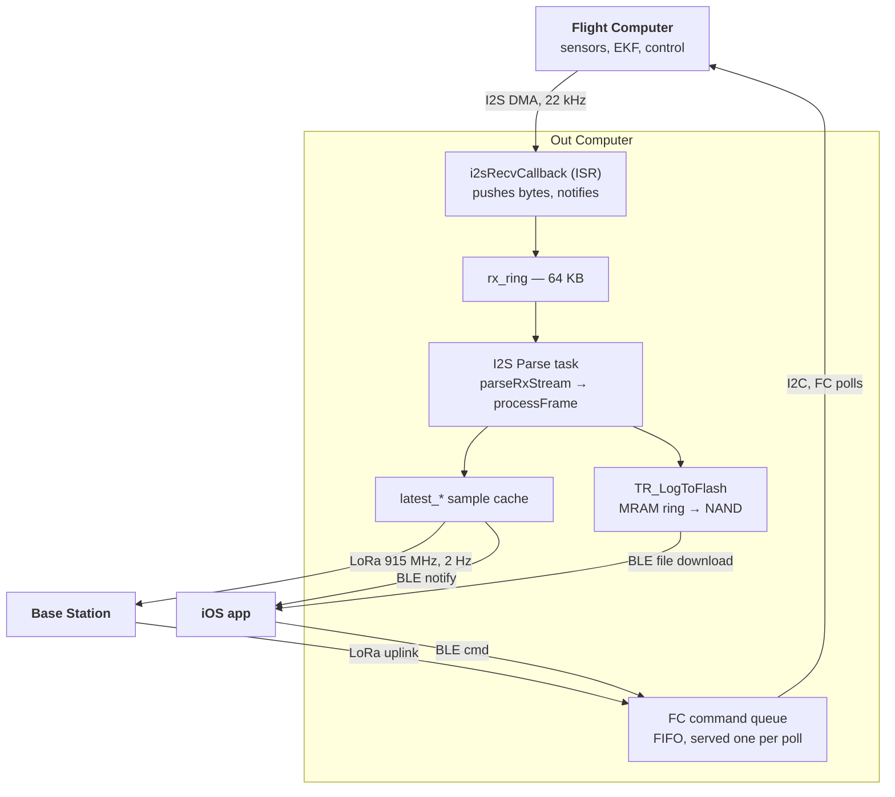

# Out Computer

The Out Computer (OC) is the rocket's radio, recorder, and power switch. It is the
board that is always awake — it holds the battery rail closed, talks to your phone
over Bluetooth, streams telemetry to the ground over LoRa, and writes the flight log
to NAND flash. It does no flight math of its own.

> **New here?** Read [Overview](README.md) first for how the three boards fit
> together. This page assumes you know the OC exists and want to know how it works.

---

## Why the split

The rocket carries two processors. The [Flight Computer](flight-computer.md) (FC) is an
ESP32-P4 running the sensor loop, the EKF, and the control laws; the Out Computer is an
ESP32-S3 running everything that touches the outside world.

The division exists because those two jobs have incompatible timing. Flight math wants
a loop that never blocks — a 200 ms stall in the EKF is a lost flight. Storage and
radio work is *made* of blocking: a NAND page erase, a LoRa transmit, a BLE file
transfer. Putting them on one core means the slow work stalls the fast work. So the FC
gets a processor where nothing blocks, and the OC absorbs everything that does.

That is also why the OC owns the power rail. The FC and all the sensors sit behind a
switch the OC controls, which means the pack can be plugged in hours before launch
while drawing only the OC's idle current, and the flight stack is powered up from your
phone at the pad.

## At a glance

| | |
|---|---|
| **Chip** | ESP32-S3, dual core |
| **Entry point** | [`app_main`](../../tinkerrocket-idf/projects/out_computer/main/main.cpp) → `setup_oc()`, then an `oc_loop` task spinning `loop_oc()` |
| **Source** | one file, [`projects/out_computer/main/main.cpp`](../../tinkerrocket-idf/projects/out_computer/main/main.cpp) (~7,500 lines) |
| **Navigation** | [section map](generated/out-computer-map.md) — line ranges for all 29 regions |
| **Talks to the FC** | I2S (telemetry in, 22 kHz DMA) + I2C (commands out, 1.2 MHz) |
| **Talks to the ground** | LoRa 915 MHz at 2 Hz |
| **Talks to your phone** | BLE GATT, 51 commands |
| **Stores** | MRAM ring buffer → NAND flash, via `TR_LogToFlash` and `TR_FlightLog` |

## Two power states

The OC has one branch at the top of its main loop, and it is the most important
structure on the board: **is the FC rail on or off?**

In the **idle** state only BLE is running. Peripheral init is deferred entirely —
NAND, MRAM, LoRa and I2S are not even initialized — so the board sits at roughly a
milliamp and a pack lasts weeks on the pad. The app can still connect, read config,
and download previous flights in this state.

In the **active** state the rail is closed, the FC boots, and the OC starts doing all
four of its jobs at once.

The transition off is worth noting: **powering down is a reboot, not a teardown.**
`esp_restart()` is called deliberately rather than unwinding each peripheral, because
surgical teardown left residual state that broke the next power-on (a held I2S APB
lock, an I2C bus that could not be re-acquired, a dedup filter that then rejected every
frame). A restart reaches the same idle state as a cold boot, with every driver freshly
initialized. See the *BLE command dispatch* section of the [map](generated/out-computer-map.md).

## Execution model

Three FreeRTOS tasks, **all pinned to core 1**. Core 0 is left to the Bluetooth
controller.

| Task | Priority | Stack | When it runs |
|---|---|---|---|
| `oc_loop` | 5 | 12 KB | always — the `loop_oc()` body |
| `I2S Parse` | 6 | 4 KB | woken by the I2S DMA callback |
| `OTA Feed` | 6 | 4 KB | only while relaying a firmware image to the FC |

The parser outranks the main loop, so incoming telemetry preempts everything else on
core 1. That is the right priority order, and it is also why anything slow inside
`loop_oc()` is a problem: it cannot starve the parser, but it *can* starve LoRa
transmits, BLE service, and the FC's I2C polls. The loop is wrapped in
`LOOP_STALL_INSTR` macros that log any call exceeding 100 ms, which is how the
periodic-stall bug in #90 was tracked down.

## How data moves

### Telemetry in

The FC streams packed sensor frames over I2S as a continuous byte stream. On the OC
side an ISR-context DMA callback pushes those bytes into a 64 KB ring and notifies the
parser task; the parser pulls complete frames out, CRC-checks them, and dispatches on
message type. Frames that survive land in two places — a cache of the latest sample per
type (which feeds LoRa and BLE) and, when logging is active, the flash logger.

Two behaviors in this path are easy to misread as bugs:

- **The DMA callback drops data on purpose.** While the phone is being served — a file
  download, a listing, a delete — `i2s_ingest_paused` makes the callback return
  immediately without touching the ring. FC sensor data during a phone transfer is
  uninteresting (the rocket is not flying), and parsing it would compete with BLE and
  flash for core 1. See `i2sRecvCallback`.
- **The ring drops oldest, not newest.** `rxPush` overwrites the tail on overflow, so a
  burst costs you the oldest bytes rather than the whole DMA buffer. Overflow is
  counted and surfaced in the stats block.

### Commands out

The OC never pushes to the FC — the FC polls it over I2C, and the OC answers with a
combined `[status frame][optional config frame]` response of exactly
`FC_COMBINED_READ_SIZE` (96) bytes. Commands therefore queue rather than send.

The queue is FIFO with three deliberate quirks, all of them scar tissue from #366:
commands snapshot their config payload at enqueue time (so a later push cannot clobber
an in-flight one), a repeated command id replaces the queued payload in place rather
than flooding the queue (self-applying settings sliders stay bounded), and pyro test
commands jump to the front so a manual test keeps its immediacy instead of waiting
behind a profile sync. One idle poll is served between commands so the FC's dedup
filter sees a reset edge between back-to-back identical ids.

With the rail off the queue simply holds. Connecting and configuring before power-on
works by design — the whole sync drains in order once the FC boots.

## The flight log

Logging is a session with an explicit lifecycle: `prepareLogFile()` →
`flightlogBeginFlight()` → `startLogging()`, and the mirror on the way out. It starts
either manually (BLE cmd 23) or automatically when the `NSF_LAUNCH` flag appears in the
FC's NonSensor frames.

Frames go through a RAM staging buffer into an MRAM ring, and a flush task drains the
ring into NAND in 4080-byte pages. MRAM is there because it absorbs the write burst
without the erase latency of flash — the ring is the shock absorber between a 22 kHz
ingest stream and a storage medium that occasionally stops to erase a block.

**Once the vehicle reports `LANDED`, no new flight log can be opened until the OC
reboots.** Post-flight ground handling can re-trip the FC's launch detect, and without
the lockout that opens a junk session full of ground data that only closes at power-off
(#317). A simulator re-arm clears it, since the FC leaving `LANDED` is impossible in a
real flight.

## Radios

### LoRa

Downlink runs at `LORA_TX_RATE_HZ` (2 Hz) — a packed telemetry payload with a
two-byte `[network_id][rocket_id]` routing header. Between transmits the radio sits in
receive mode for uplink commands from the base station, which are addressed and
filtered by network and rocket id. While in `READY` or `PRELAUNCH` the OC also emits a
name beacon so the base station can label it in the tracker.

Most of the LoRa code is not the happy path — it is recovery. Two mechanisms handle the
case where the two ends disagree about what channel they are on:

- **Rendezvous** (#71): after 15 s of silence the rocket starts hopping briefly to a
  factory rendezvous channel on a duty cycle (10 s on, 20 s back), giving the base
  station's scan a guaranteed meeting point even when the saved frequencies differ by
  more than the scan range. Suppressed in flight.
- **Hop fallback** (#40/#41): the equivalent for the frequency-hopping mode.

**Frequency is locked for the duration of a flight.** On `INFLIGHT` the lock latches,
uplink retune commands are ignored, and rendezvous is suppressed — momentary silence in
flight is usually an SNR dip, and leaving the operating frequency mid-flight to chase it
would be much worse. The transition rule itself is a pure function
(`computeFreqLockForFlight`) shared with the base station so both ends follow identical,
unit-tested rules.

### BLE

The OC runs a GATT server and dispatches 51 commands from a flat `if (ble_cmd == N)`
chain in `loop_oc`.
The chain is roughly grouped: file operations and camera control work with the rail
off; simulator, config, pyro, servo, and identity commands need it on.

The authoritative list is the dispatch chain itself. A few worth knowing:

| Cmd | Effect | Rail |
|---|---|---|
| 1 | Toggle camera recording | off ok |
| 2 | File list (paginated, 5/page) | off ok |
| 3 | Delete file — refused while `INFLIGHT` | off ok |
| 8 | **Toggle** the FC power rail | either |
| 9 | Phone time sync (for log filenames) | off ok |
| 23 | Toggle logging | on |
| 40–42 | Set unit name / network id / rocket id | either |

Connection parameters are policy, not default: the OC explicitly requests a slow
interval (200 ms, latency 4) while the rail is off and a fast one (30 ms) for
transfers, and it disables the BLE library's own auto-negotiation so the two cannot
race. The idle link is worth roughly 1 mA against 7 mA for the fast link, so the policy
is most of the standby power story.

---

## Gotchas

Things that have cost real bench time.

**`sdkconfig` is generated and untracked, and it overrides `sdkconfig.defaults`.**
Editing the defaults file changes nothing if a stale `sdkconfig` is sitting next to it.
A symbol that no longer exists fails silently rather than erroring. When a config change
appears to have no effect, delete `sdkconfig` and rebuild.

**Duplicate `ble_cmd ==` values fail silently.** The dispatch is a first-match if/else
chain, so assigning a number twice turns the second handler into dead code with no
compiler error, no link error, and no test failure — exactly what shipped in #132 and
#148. [`tools/check_ble_command_ids.py`](../../tools/check_ble_command_ids.py) makes it
a CI failure. Note it only sees merged code; two branches can still assign the same
number independently and collide at merge.

**Command 8 is a toggle, not "power on".** Sending it twice puts you back where you
started, and the second one reboots the board. Bench scripts that assume it is
idempotent will fight you.

**Power-on blocks the loop for seconds.** `initPeripherals()` runs inline in the
command handler: NAND, MRAM, LoRa, I2C, I2S, plus log recovery. There is no telemetry
and no BLE responsiveness while it runs. That latency is the reason the app shows a
spinner rather than appearing to hang.

**A download with the rail off used to leave the link fast.** The slow-parameter
request only fires on the connect edge, so an idle-time download would switch to the
fast link and stay there — 7 mA instead of 1 mA until the app disconnected. The fix
mirrors the connect-edge policy after every transfer; if you add a new transfer path,
it needs the same treatment (#524).

**The I2C slave is initialized late, on purpose.** It waits for `dma_cb_count > 50` —
proof the FC is alive and clocking I2S — before joining the bus. Bringing it up earlier
raced FC boot.

**Identity NVS migrates; LoRa NVS wipes.** The two namespaces version separately and
deliberately behave differently. Wiping identity is what caused the #133-era regression
where the base station came back with a different network id and the filter silently
dropped everything. If you add a schema version bump, be sure which side you are on.

---

## Where to look next

- [Section map](generated/out-computer-map.md) — every region of `main.cpp` with line
  ranges and links, regenerated from the source banners
- [`tools/check_ble_command_ids.py`](../../tools/check_ble_command_ids.py) — the
  wire-code guard, and a readable account of why the command space needs one
- Components this board leans on: `TR_LogToFlash`, `TR_FlightLog`, `TR_I2S_Stream`,
  `TR_I2C_Interface`, `TR_BLE_To_APP`, `TR_RadioLink`
- [Protocols](protocols.md) — frame formats, message types, and the command spaces
- Shared wire contract: [`RocketComputerTypes.h`](../../tinkerrocket-idf/components/TR_RocketComputerTypes/RocketComputerTypes.h)

- [Flight Computer](flight-computer.md) — what produces the telemetry this board ingests
- [Base Station](base-station.md) — the other end of the LoRa link
- [iOS App](ios-app.md) — the BLE peer on the other side of the phone link

The protocol reference is not written yet — see [the index](README.md) for status.
