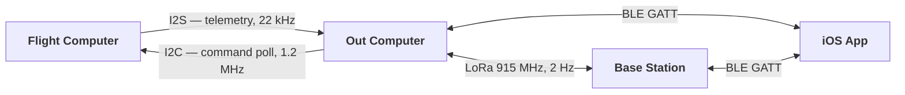

# Protocols

Four boards talk to each other over four different links, and every one of them
carries a hand-assigned number somewhere. This page explains what the links are and
why they are shaped the way they are. The numbers themselves live in the
**[generated protocol reference](generated/protocol-reference.md)**, which is extracted
from source and re-checked in CI.

> **New here?** Read [Overview](README.md) first. Each board's page covers its own end
> of these links: [Flight Computer](flight-computer.md), [Out Computer](out-computer.md),
> [Base Station](base-station.md), [iOS App](ios-app.md).

---

## Why the tables are generated

Wire numbers are the worst thing to document by hand. A command number copied into a
table and later reassigned in firmware does not look stale — it looks authoritative, and
it is wrong. Someone then debugs the wrong thing for an afternoon.

This project has already paid for that class of mistake. In #132 and #148, BLE commands
56, 57 and 58 were each assigned to two features. The dispatch is a flat first-match
`if (ble_cmd == N)` chain, so the second handler in each pair became dead code with no
compiler error, no link error, and no failing test. It shipped.

So the numbers are not written down here. They are extracted:

| Table | Extracted from |
|---|---|
| Frame format | the `SOF` constants in `TR_I2C_Interface.h` |
| FC ↔ OC message types | the CI-enforced registry in `tests_cpp/`, resolved against the header |
| Struct wire sizes | `static_assert(sizeof(X) == N)` — compiler-enforced |
| BLE command spaces | the `ble_cmd ==` dispatch chains in both firmwares |
| Flags, health bits, LoRa | named constants in `RocketComputerTypes.h` |

```bash
python3 tools/gen_protocol_reference.py
```

CI runs it with `--check` and fails if the committed reference disagrees with the
sources, so the tables cannot silently rot. The generator also reports what it *cannot*
document — commands and message codes with no comment in source — rather than leaving a
blank column that looks like an absence of meaning.

## The four links



Each link is shaped by a different constraint.

### FC ↔ OC — two links, on purpose

**I2S carries telemetry from the FC to the OC** as a continuous byte stream at 22 kHz.
It is one-directional and unacknowledged, because the FC must never block waiting for
storage. Frames are self-delimiting: the receiver resynchronizes on the start-of-frame
pattern and drops anything that fails CRC.

**I2C carries commands the other way** — and the FC is the master. The OC never
initiates. It queues commands and answers when polled, with a combined
`[status][optional config]` response of exactly 96 bytes.

That looks backwards until you consider what the alternative costs. If the OC could
interrupt the FC, then a phone command, a LoRa uplink, or a BLE file transfer could all
land in the middle of an EKF update. Polling puts the flight loop in control of when it
is willing to be interrupted — and in flight, the answer is *never*: the poll is skipped
entirely for the duration.

During a firmware update the I2S link **reverses**: the OC becomes master TX and pumps
the image to the FC as slave RX. That is the only time data flows FC-ward over I2S, and
the handover has to be sequenced carefully so both ends never drive the clock at once.

### OC ↔ Base Station — LoRa

2 Hz downlink, 915 MHz. Every telemetry packet carries a two-byte
`[network_id][rocket_id]` routing header. Uplink commands are addressed to a specific
rocket, or broadcast.

Three layers keep two users at the same field apart: the **network ID** (a hashed name,
filtered at both ends), the **LoRa syncword** (prevents radio-level decode), and the
**rocket ID** (unique within a network). Rocket identity is therefore the *pair* — rocket
IDs alone are not unique across networks, which is why every app-side cache keys on
`(networkID, rocketID)`.

Name beacons use a distinct `0xBE` sync byte. Telemetry from network 190 would start with
the same byte, so beacons are additionally disambiguated by length — see the
[Base Station](base-station.md) page.

### Device ↔ App — BLE GATT

One service, four characteristics: telemetry, command, file ops, file transfer.
Telemetry and config both arrive as JSON on the telemetry characteristic, distinguished
by a `type` field, with heavily abbreviated keys because the frame is budgeted against
the negotiated MTU. File transfer is binary chunks with a 7-byte header.

**The two BLE command spaces are independent.** The app talks to either an Out Computer
or a Base Station, never both on one connection, so the same number means different
things: 50 is mag-cal start to the Out Computer and relay-to-rocket to the Base Station.
That overlap is correct and deliberate. Uniqueness is enforced *within* each device's
dispatch, not across them.

## Adding to the wire

The rule that matters: **the firmware dispatch is the authority, and it is a
first-match chain.**

1. Pick an unused number *in that device's space*. Check the
   [generated reference](generated/protocol-reference.md), not your memory.
2. Add the branch, and **put a comment on it** — that comment becomes the description
   in the generated table, and its absence is reported.
3. For a new FC ↔ OC message type, add it to the registry in
   `tests_cpp/test_rocket_computer_types.cpp` and bump the count. The uniqueness check
   is only as strong as the list it walks; a code missing from the registry is
   unprotected, and the generator flags it.
4. If it carries a struct, add a `static_assert` on its size. That turns a wire-format
   change into a build failure instead of a corrupted log.
5. Regenerate and commit:

```bash
python3 tools/gen_protocol_reference.py
```

### The guards, and what each one misses

| Guard | Catches | Blind to |
|---|---|---|
| [`check_ble_command_ids.py`](../../tools/check_ble_command_ids.py) | duplicate BLE commands within a device | codes on unmerged branches |
| `MessageTypeCodes_AllUnique` gtest | duplicate FC ↔ OC message codes | anything absent from its registry |
| `static_assert(sizeof(...))` | struct size drift | field *reordering* at the same size |
| `gen_protocol_reference.py --check` | documentation drift | nothing about correctness |

The gap worth naming: **none of these see across branches.** Two feature branches can
each assign the same free command number, both pass CI independently, and collide only
once both are merged — at which point the second handler is dead and nothing says so.
If two people are adding commands at once, reserve the numbers before writing the code.

---

## Where to look next

- **[Generated protocol reference](generated/protocol-reference.md)** — every table
- [`RocketComputerTypes.h`](../../tinkerrocket-idf/components/TR_RocketComputerTypes/RocketComputerTypes.h)
  — the shared wire contract, and the only file all four codebases agree on
- [`tools/check_ble_command_ids.py`](../../tools/check_ble_command_ids.py) — the
  duplicate guard, and a readable account of why it exists
- [`tests_cpp/test_rocket_computer_types.cpp`](../../tests_cpp/test_rocket_computer_types.cpp)
  — the message-type registry and the struct-size assertions
