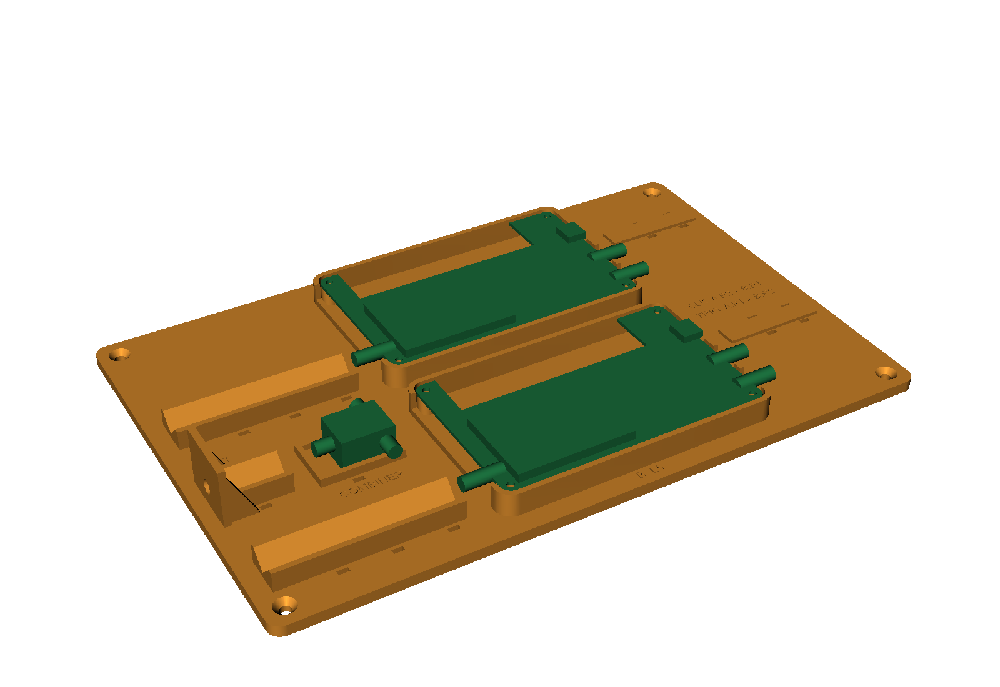
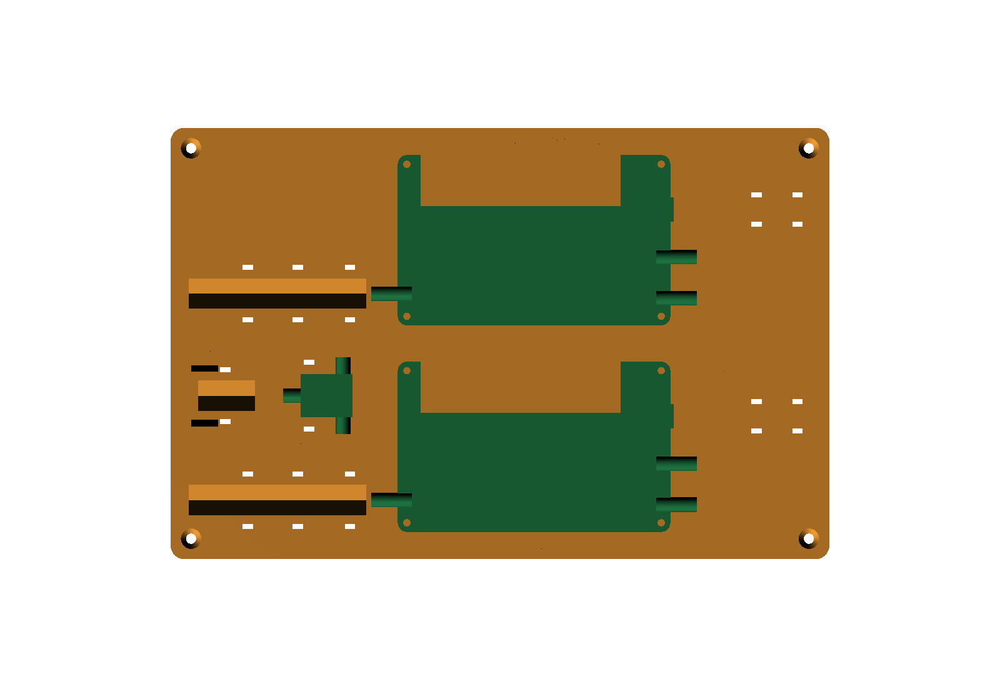

# HackRF Pro bench rig

One printed plate that holds two bare HackRF Pro boards for the two-transmitter rig: one board sends the L1 band, the
other the L5 band, sharing one 10 MHz clock and one start trigger, and the plate carries the RF parts between them
and the receiver.

## Layout

- **Boards.** Board A (L1, clock and trigger master) sits behind board B (L5), both the same way round, each on four
  8 mm standoffs inside a pocket that covers its underside. The pocket walls stop 1 mm above the board top, are
  notched for the three SMAs and the USB-C, and drop to 3 mm along the edge with the buttons and side LEDs. The
  boards drop in from above (their connectors pass down through the notches) and screw down.
- **Right side.** The clock jumper (A.P2 to B.P1) and the trigger jumper (A.P1 to B.P2) run straight between the
  boards' right-edge SMAs. Each USB-C cable lies on a raised strip and is held by two zip ties.
- **Left side.** Each antenna output runs into a V-channel that carries up to three 9.5 mm inline attenuators on the
  SMA's axis (13.8 mm above the plate bottom), so the stack never hangs off the board connector. The channels start
  14 mm from the board so a wrench fits the first coupling nut, and each attenuator gets its own zip tie. The
  combiner sits in a fitted cradle between the two channels, raised so its three ports are on the same axis: its two
  inputs face the two arms, and its sum port faces the DC block, with 8 mm of slide to close the gap for a short
  cable or a straight adapter. A low rim locates it and a zip tie over its body holds it down. The OUT tab at the
  far left takes an SMA bulkhead feedthrough, with the DC block on a short V-saddle behind it, in line with the
  combiner's sum port.
- **Base.** Zip-tie slots with grooves underneath so the tie heads sit flush, four rubber-foot recesses, four
  countersunk screw holes for fixing the plate to the bench, and engraved labels.

## Files

| File | What it is |
|---|---|
| `hackrf_pro_bench_rig.py` | CadQuery source; every dimension is a named parameter at the top |
| `hackrf_pro_bench_rig.step` | the rig; imports into Fusion 360 as an editable body |
| `hackrf_pro_bench_rig_assembly.step` | the rig with simple stand-ins for the boards and the combiner, for checking fit |
| `hackrf_pro_bench_rig.stl` | print file |
| `board_geom.py`, `board_geom.json` | the board's outline, holes and edge connectors, read from Great Scott Gadgets' HackRF Pro layout |
| `render_rig.py` | the two renders above (VTK, offscreen) |

## Printing

The plate is 290 × 190 mm and fits a 300 × 300 mm bed. Print it flat, plate down, with no supports. PETG at 0.2 mm
layers, three perimeters and 15-20 % infill is plenty.

## Parts

- 8 M3 heat-set inserts that fit a 4.0 mm hole, no longer than 6 mm, and 8 M3 × 6 mm pan-head screws for the boards.
- A 2-way 0° Wilkinson power combiner: 50 Ω, SMA female ports, covering at least 1.1-1.7 GHz, with at least 15 dB of
  port-to-port isolation, in a coaxial block case 18.8 mm wide (inputs out of its sides) by 22.9 mm deep (sum port
  out of the front) on a 1 mm foot, with every port axis 7.4 mm above its base. That is the cradle's size; the
  `COMB_*` parameters in the source change it for another case. It sits after the attenuators and before the DC
  block, so it never sees the receiver's antenna bias. Its loss, about 3.7-4 dB per input across L5 to L1, comes out
  of the attenuators rather than the transmit gain: a path that uses 21 dB of attenuation today needs about 17 dB in
  its arm, and an 11 dB path about 7 dB.
- SMA inline attenuators with 9.5 mm bodies, up to three per arm, valued for the level plan, and one SMA inline DC
  block with a 9.5 mm body.
- One SMA female-to-female bulkhead feedthrough (1/4-36 thread) for a 3 mm panel; the tab's hole is 6.5 mm.
- Coax: two SMA male-to-male jumpers about 15 cm long for clock and trigger, two short SMA male-to-male cables from
  the arms to the combiner inputs, and a short SMA male-to-male cable or a straight male-to-male adapter from the
  combiner's sum port to the DC block.
- Zip ties up to 4.5 mm wide.
- Four 12.7 mm adhesive rubber feet, or four countersunk screws with shanks up to 4.5 mm to fix it to the bench.

## Assembly

1. Press the inserts into the standoffs.
2. Drop each board into its pocket and screw it down.
3. Fit the bulkhead to the OUT tab, put the DC block on its inner port, and tie the DC block onto its saddle.
4. Thread three attenuators onto each antenna SMA so they rest in the channel, and tie each one down.
5. Set the combiner in its cradle with the sum port toward the DC block, connect the sum port to the DC block
   (sliding the combiner to suit the cable or adapter), strap it down with a zip tie, then run each arm's end to a
   combiner input.
6. Fit the jumpers: A.P2 to B.P1 (clock) and A.P1 to B.P2 (trigger). On A, set P2 to clock out and P1 to trigger
   out; on B, set P1 to clock in and P2 to trigger in (`hackrf_clock -1 ...` / `hackrf_clock -2 ...`; see
   `hackrf_clock --help`). Keep the trigger jumper connected: an unconnected trigger input fires on its own.
7. Lay the USB cables on their strips and tie them down.

## Regenerating

- `python3 hackrf_pro_bench_rig.py` (CadQuery 2.7) rewrites the STEP, STL and assembly files, plus
  `boards_standin.stl` for the renders (not committed); then `python3 render_rig.py` (VTK) redraws the PNGs.
- The board facts come from `praline.kicad_pcb` in
  [greatscottgadgets/hackrf-pro](https://github.com/greatscottgadgets/hackrf-pro) (8 MB, not committed): download it
  next to `board_geom.py` and run that with KiCad's bundled Python to refresh `board_geom.json`. The geometry is
  derived from Great Scott Gadgets' HackRF Pro design, licensed CERN-OHL-P-2.0.
